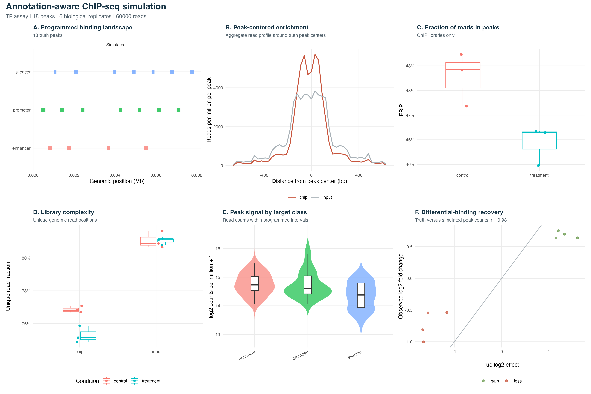
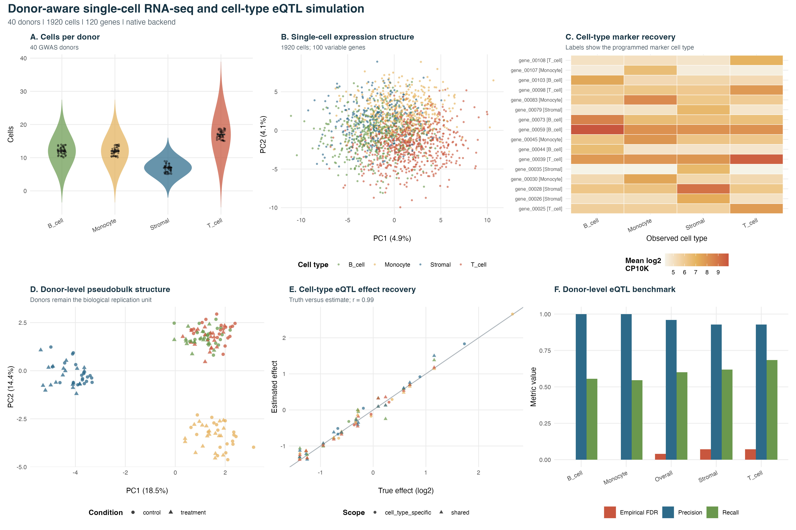

# simitall

`simitall` (SIMulate IT ALL) is an R-first toolkit for building coordinated,
truth-aware genomics simulations. It connects genome and annotation generation,
DNA read simulation, hybrid assembly evaluation, GWAS cohorts, phenotype
architectures, standalone or GWAS-linked RNA-seq experiments, breeding
designs, donor-aware single-cell experiments, cell-type eQTLs, and SimuPOP
mating schemes through one R API.

The goal is not to replace mature simulators. `simitall` provides a reproducible
R layer that makes those tools work together, keeps parameters in one analysis,
and emits compatible truth files for benchmarking.

## What it can simulate

- Random genomes or reference-derived genomes with tandem and motif repeats
- Uniform, Poisson, or fixed repeat spacing with optional GC matching
- Haploid through polyploid genome copies with SNP and indel divergence
- Genes, CDS features, operons, promoters, TSSs, terminators, rRNA/tRNA
  clusters, riboswitches, CRISPR arrays, plasmids, and regulatory elements
- Illumina reads with ART
- PacBio CLR and HiFi/CCS reads with PBSIM/PBSIM3
- Oxford Nanopore reads with Badread
- Hybrid assembly grids with Unicycler and evaluation with QUAST
- Annotation-aware TF, histone-mark, and nucleosome ChIP-seq with matched
  inputs, differential binding, FASTQ reads, peak truth, and publication plots
- GWAS cohorts with LD blocks, recombination maps, subpopulations, and
  quantitative or binary phenotypes
- RNA-seq from the same GWAS individuals, with cis/trans eQTLs, condition and
  batch effects, genotype-by-condition interactions, latent confounders, and
  allele-specific expression
- Standalone bulk and single-cell RNA-seq experiments with technical,
  biological, or mixed replicates, even when no genotype data are available
- eQTL association testing with causal-truth precision and recall summaries
- Single-cell RNA-seq from GWAS donors with cell types, marker programs,
  pseudotime, cell-type-specific eQTLs, dropout, ambient RNA, and doublets
- Donor-by-cell-type pseudobulk and cell-type eQTL benchmarking without
  treating cells as independent biological replicates
- Advanced phenotype architectures through `simplePHENOTYPES`
- F1, F2, backcross, selfing, RIL, NIL, doubled-haploid, NAM, and MAGIC
  populations
- SimuPOP mating schemes through `reticulate`, with VCF-compatible genotype
  output and sample metadata

Truth outputs include FASTA, VCF, GFF3, BED, TSV, and JSON files. Functions
write results to user-selected output paths; generated analyses are not stored
inside the package source tree.

## Installation on Apple Silicon

The R package is small. Large reference genomes and command-line tools are
installed or downloaded separately.

```bash
cd /Users/nirwantandukar/Documents/Github/simitall

conda env create -f environment-macos.yml
conda activate simitall

R -q -e 'install.packages("remotes")'
R -q -e 'remotes::install_local(".", dependencies = TRUE)'
```

QUAST and SimuPOP are installed with `pip` in the supplied environment because
native Conda builds are not consistently available for `osx-arm64`.

Gene-level RNA-seq simulation uses base R. FASTQ generation is optional and
uses the Bioconductor package `Rsubread`, which is included in
`environment-macos.yml`. If it is missing from an existing environment, install
it with:

```r
if (!requireNamespace("BiocManager", quietly = TRUE)) {
  install.packages("BiocManager")
}
BiocManager::install("Rsubread")
```

ChIP-seq read simulation can use the optional Bioconductor package
`ChIPsim`, which is also included in `environment-macos.yml`:

```r
BiocManager::install("ChIPsim")
```

Single-cell simulation always has a native R backend. For the optional
[Splatter](https://bioconductor.org/packages/release/bioc/html/splatter.html)
technical backend and standard `SingleCellExperiment` output, install:

```r
if (!requireNamespace("BiocManager", quietly = TRUE)) {
  install.packages("BiocManager")
}
BiocManager::install(c("splatter", "SingleCellExperiment"))
```

These packages are also listed in `environment-macos.yml` for a fresh Conda
environment. `backend = "auto"` uses Splatter when available and otherwise
falls back to the native gamma/negative-binomial technical model.

For package development:

```r
install.packages(c("devtools", "roxygen2", "testthat"))
devtools::document()
devtools::test()
devtools::check()
```

## Quick start

Load the package and locate its bundled, lightweight example files:

```r
library(simitall)

demo_genome <- system.file(
  "extdata", "examples", "demo_genome.fa",
  package = "simitall"
)
demo_panel <- system.file(
  "extdata", "panels", "demo_panel.fa",
  package = "simitall"
)
```

Generate a synthetic genome with controlled repeats:

```r
dir.create("results", showWarnings = FALSE)

simulate_genome(
  out_fa = "results/synthetic_genome.fa",
  random_genome = TRUE,
  random_length = 100000,
  random_gc = 0.51,
  mode = "both",
  n_events = 10,
  seg_len = 500,
  copies = 3,
  spacing_distribution = "poisson",
  spacing_mean = 5000,
  ploidy = 2,
  snp_rate = 0.001,
  indel_rate = 0.0001,
  seed = 1
)
```

The genome simulator can also modify an existing reference:

```r
simulate_genome(
  in_fa = demo_genome,
  out_fa = "results/reference_with_repeats.fa",
  n_events = 3,
  seg_len = 100,
  copies = 4,
  spacing_distribution = "fixed",
  fixed_spacing = 1000,
  gc_preserve = TRUE
)
```

Generate annotations:

```r
simulate_annotations(
  in_fa = "results/synthetic_genome.fa",
  out_prefix = "results/synthetic_genome",
  n_genes = 80,
  rrna_clusters = 1,
  trna_per_cluster = 8,
  riboswitch_count = 4,
  crispr_count = 1,
  plasmid_count = 1,
  regulatory_default_human = TRUE,
  seed = 1
)
```

## Sequencing and assembly

All external programs are called from R:

```r
sim_illumina_art(
  ref_fa = "results/synthetic_genome.fa",
  outprefix = "results/reads/illumina_",
  cov = 30
)

sim_pacbio(
  ref_fa = "results/synthetic_genome.fa",
  outdir = "results/reads/pacbio_hifi",
  cov = 20,
  type = "HIFI"
)

sim_nanopore(
  ref_fa = "results/synthetic_genome.fa",
  outdir = "results/reads/nanopore",
  cov = 20
)
```

Run a small coverage grid, hybrid assemblies, and QUAST:

```r
run_grid_both(
  simref_fa = "results/synthetic_genome.fa",
  tag = "demo",
  ill_covs = c(20, 40),
  pb_covs = c(10, 20),
  output_dir = "results/reads"
)

run_unicycler_grid(
  tag = "demo",
  reads_dir = "results/reads",
  output_dir = "results/assemblies",
  ill_covs = c(20, 40),
  pb_covs = c(10, 20)
)

run_quast_grid(
  tag = "demo",
  ref_fa = "results/synthetic_genome.fa",
  assemblies_dir = "results/assemblies",
  output_dir = "results/evaluation",
  ill_covs = c(20, 40),
  pb_covs = c(10, 20)
)

summarize_quast(
  quast_root = "results/evaluation/demo",
  out_csv = "results/quast_summary.csv"
)
```

## ChIP-seq

`simulate_chipseq()` connects the existing promoter, enhancer, silencer, gene,
and regulatory annotations to transcription-factor, histone-mark, or
nucleosome ChIP-seq experiments. Candidate intervals can come from GFF3, a
user BED file, or random genomic positions when no annotation is supplied.

```r
chip <- simulate_chipseq(
  genome_fa = "results/synthetic_genome.fa",
  annotation_gff3 = "results/synthetic_genome.gff3",
  out_prefix = "results/chipseq/tf_demo",
  assay_type = "TF",
  target_features = c("promoter", "enhancer", "silencer"),
  n_peaks = 100,
  conditions = c("control", "treatment"),
  biological_replicates = 3,
  technical_replicates = 1,
  differential_binding_fraction = 0.2,
  signal_fraction = 0.35,
  n_reads = 100000,
  input_reads = 100000,
  backend = "auto",
  seed = 1
)
```

Histone-mark presets choose suitable target classes, widths, and broad-peak
behavior. Available presets are `H3K4me3`, `H3K27ac`, `H3K27me3`, and
`H3K36me3`:

```r
simulate_chipseq(
  genome_fa = "results/synthetic_genome.fa",
  annotation_gff3 = "results/synthetic_genome.gff3",
  out_prefix = "results/chipseq/h3k27ac",
  assay_type = "histone",
  histone_mark = "H3K27ac",
  conditions = c("control", "treatment"),
  biological_replicates = 3,
  seed = 2
)
```

`backend = "auto"` uses ChIPsim's strand-specific binding/read-density model
for small references when available. Large references automatically use the
native interval sampler to avoid allocating chromosome-length dense vectors.
Both backends produce the same interoperable truth, QC, peak-count, read-
position, metadata, and FASTQ interfaces.

Generate a six-panel PDF and PNG with genomic peak locations, aggregate
peak-centered enrichment, FRiP, library complexity, signal by annotation
class, and differential-binding recovery:

```r
plot_chipseq_results(
  chip_prefix = "results/chipseq/tf_demo",
  out_prefix = "results/figures/tf_chipseq"
)
```



The complete lightweight example and all panel source-data tables are
reproducible with:

```bash
Rscript analysis/paper_fig/fig8_chipseq_simulation.R --backend native
```

Key outputs include `*.truth_peaks.bed`, `*.truth_peaks.tsv`, matched ChIP and
input FASTQs, `*.peak_counts.tsv`, `*.qc.tsv`, differential-binding truth,
sample metadata, read positions, and a JSON parameter summary.

## GWAS, RNA-seq, and phenotypes

```r
simulate_gwas_cohort(
  genome_fa = demo_genome,
  out_prefix = "results/gwas/demo",
  n_samples = 200,
  snp_rate = 0.01,
  n_pops = 2,
  ld_block_size = 50000,
  phenotype = "quantitative",
  n_causal = 10,
  seed = 1
)
```

Advanced phenotype simulation is optional and requires
`simplePHENOTYPES`:

```r
simulate_phenotypes(
  geno_file = "results/gwas/demo.vcf",
  out_prefix = "results/phenotypes/demo",
  h2 = 0.5,
  n_add_qtn = 20,
  n_traits = 2
)
```

### Standalone RNA-seq experiments

Genotypes are optional. `simulate_rnaseq_experiment()` creates a conventional
bulk RNA-seq experiment directly from sample names or an experiment design.
This is useful for differential-expression methods, batch-correction tests,
power studies, and repeated sequencing of one sample.

The replicate modes have deliberately different meanings:

- `replicate_mode = "technical"`: one biological sample with independently
  generated sequencing libraries
- `replicate_mode = "biological"`: independent biological samples with one
  library each
- `replicate_mode = "mixed"`: independent biological samples, each measured
  by multiple technical libraries

For example, simulate three technical libraries from the same biological
sample:

```r
bulk_technical <- simulate_rnaseq_experiment(
  out_prefix = "results/rnaseq/sample_A",
  sample_names = "sample_A",
  replicates = 3,
  replicate_mode = "technical",
  n_genes = 1000,
  seed = 1
)
```

To simulate three biological replicates in each of two conditions:

```r
bulk_biological <- simulate_rnaseq_experiment(
  out_prefix = "results/rnaseq/control_vs_drought",
  sample_names = c("control", "drought"),
  conditions = c("control", "drought"),
  replicates = 3,
  replicate_mode = "biological",
  n_genes = 1000,
  seed = 2
)
```

An aggregated design gives full control over biological and technical
replication. Each row describes one sample or experimental group:

```r
design <- data.frame(
  sample = c("control", "drought"),
  condition = c("control", "drought"),
  batch = c("batch1", "batch2"),
  biological_replicates = c(3, 3),
  technical_replicates = c(2, 2)
)

bulk_mixed <- simulate_rnaseq_experiment(
  out_prefix = "results/rnaseq/mixed_design",
  design = design,
  n_genes = 1000,
  seed = 3
)
```

The same design model is available for single-cell experiments. Here, three
technical capture libraries are generated from the same biological sample:

```r
sc_technical <- simulate_scrnaseq_experiment(
  out_prefix = "results/scrna/sample_A",
  sample_names = "sample_A",
  replicates = 3,
  replicate_mode = "technical",
  cells_per_replicate = 500,
  n_genes = 1000,
  cell_type_proportions = c(
    T_cell = 0.4,
    B_cell = 0.3,
    Monocyte = 0.3
  ),
  backend = "auto",
  seed = 4
)

plot_scrnaseq_results(
  scrna_prefix = "results/scrna/sample_A",
  out_prefix = "results/figures/sample_A_scrna"
)
```

Standalone single-cell output includes donor-level pseudobulk, which combines
technical captures before biological interpretation, and library-level
pseudobulk, which keeps captures separate for technical-QC analyses. Technical
replicates increase measurement precision but are not independent biological
replicates and should not be counted as separate donors in inference.

### RNA-seq from the GWAS cohort

`simulate_rnaseq_from_gwas()` uses the GWAS genotype matrix as its starting
point, so the RNA-seq sample IDs and genotypes are the same individuals used in
the association cohort. Its gene-by-sample expression model is:

```text
log2 abundance = baseline
               + cis-eQTL genotype effect
               + trans-eQTL genotype effects
               + condition effect
               + genotype-by-condition interaction
               + batch effect
               + latent confounders
               + residual noise
```

Expected abundances are converted to sample-specific library sizes and sampled
with gene-specific negative-binomial dispersion. This separates biological
causal truth from count sampling noise while retaining both in the output.

```r
rna <- simulate_rnaseq_from_gwas(
  genotype_file = "results/gwas/demo.geno.tsv",
  out_prefix = "results/rnaseq/demo",
  annotation_gff3 = "results/synthetic_genome.gff3",
  n_cis_eqtl = 200,
  n_trans_eqtl = 50,
  cis_window_bp = 1e6,
  condition_levels = c("control", "drought"),
  batch_levels = c("batch1", "batch2"),
  condition_effect_fraction = 0.10,
  gxe_fraction = 0.20,
  ase_fraction = 0.25,
  n_latent = 3,
  seed = 1
)
```

If no GFF3 is supplied, synthetic genes are distributed across the simulated
variant coordinates. A user-provided sample metadata TSV can assign conditions,
batches, populations, families, or other labels; it must contain a `sample`
column matching the genotype samples.

Key outputs are:

- `*.counts.tsv`: negative-binomial gene counts
- `*.expression.tsv`: log2 counts per million for association testing
- `*.expected_counts.tsv`: expected counts before count sampling
- `*.sample_metadata.tsv`: GWAS sample IDs, conditions, batches, and libraries
- `*.gene_metadata.tsv`: coordinates, baselines, and dispersions
- `*.eqtl_truth.tsv`: causal cis/trans and genotype-by-condition effects
- `*.condition_truth.tsv` and `*.batch_truth.tsv`: known experimental effects
- `*.latent_scores.tsv` and `*.latent_loadings.tsv`: hidden-factor truth
- `*.ase_truth.tsv` and `*.ase_counts.tsv`: allele-specific expression truth
- `*.summary.json`: parameters and generated feature counts

Benchmark eQTL recovery against the known causal pairs:

```r
eqtl <- benchmark_eqtl(
  genotype_file = "results/gwas/demo.geno.tsv",
  expression_file = rna$expression,
  out_prefix = "results/eqtl/demo",
  sample_metadata = rna$sample_metadata,
  truth_file = rna$eqtl_truth,
  pair_mode = "truth_neighborhood",
  cis_window_bp = 1e6,
  covariates = c("condition", "batch"),
  test_gxe = TRUE
)
```

The benchmark writes association statistics, BH-adjusted p-values, causal-pair
labels, and precision, recall, and empirical FDR summaries. `pair_mode = "cis"`
tests all local variant-gene pairs when gene metadata is supplied, while
`pair_mode = "all"` is available for deliberately small datasets.

### Optional RNA-seq FASTQ files

The count simulator is the causal experimental engine. When sequence-level
reads are needed, `simulate_rnaseq_reads()` passes its expression levels to
`Rsubread::simReads()` and writes one single- or paired-end FASTQ library per
GWAS individual:

```r
simulate_rnaseq_reads(
  expression = rna$counts,
  transcript_fasta = "results/synthetic_genome.genes.fa",
  out_dir = "results/rnaseq/fastq",
  library_size = 100000,
  read_length = 100,
  paired_end = TRUE,
  seed = 1
)
```

Transcript FASTA IDs must match the expression gene IDs. For isoforms, pass a
two-column `transcript_gene_map` containing `transcript_id` and `gene_id`; gene
abundance is then divided among mapped transcripts. FASTQ simulation can also
be requested directly with `simulate_rnaseq_from_gwas(simulate_reads = TRUE,
transcript_fasta = ...)`.

### Result summaries and publication figures

Summarize the count simulation and eQTL benchmark in one result row:

```r
summarize_rnaseq_results(
  rnaseq_prefix = "results/rnaseq/demo",
  eqtl_prefix = "results/eqtl/demo",
  out_tsv = "results/figures/rnaseq_summary.tsv"
)
```

Generate a six-panel PDF and PNG containing library-size distributions,
expression PCA, the eQTL association landscape, causal-effect recovery, ASE
recovery, and precision/recall/FDR metrics:

```r
plot_rnaseq_eqtl_results(
  rnaseq_prefix = "results/rnaseq/demo",
  eqtl_prefix = "results/eqtl/demo",
  out_prefix = "results/figures/rnaseq_eqtl"
)
```

Each panel's source data are written as separate CSV files beside the figure.
The repository also includes a complete reproducible runner that starts from
the bundled genome and produces the cohort, RNA-seq data, benchmark, figure,
summary, and panel source tables:

```bash
Rscript analysis/paper_fig/fig6_rnaseq_eqtl_simulation.R
```

See `analysis/paper_fig/README.md` for runner options and paper-scale guidance.

### Single-cell RNA-seq from GWAS donors

`simulate_scrnaseq_from_gwas()` expands each GWAS individual into a donor with
many cells while keeping the original genotype, population, family, phenotype,
condition, and batch information. Its biological model is:

```text
single-cell log2 abundance = technical gene/cell scaffold
                           + cell-type marker program
                           + shared or cell-type-specific eQTL effect
                           + condition and genotype-by-condition effects
                           + donor effect
                           + pseudotime effect
                           + batch and latent effects
                           + residual cell noise
```

Expected abundance is converted into UMI libraries and sampled with
gene-specific negative-binomial dispersion. Optional expression-dependent
dropout, ambient RNA, and doublet profiles are applied while their parameters
and labels are retained as simulation truth.

```r
sc <- simulate_scrnaseq_from_gwas(
  genotype_file = "results/gwas/demo.geno.tsv",
  out_prefix = "results/scrna/demo",
  sample_metadata = "results/gwas/demo.pheno.tsv",
  annotation_gff3 = "results/synthetic_genome.gff3",
  n_genes = 1000,
  cells_per_donor = 100,
  cell_type_proportions = c(
    T_cell = 0.35,
    B_cell = 0.25,
    Monocyte = 0.25,
    Stromal = 0.15
  ),
  trajectory_cell_types = c("T_cell", "Monocyte"),
  n_cis_eqtl = 200,
  n_trans_eqtl = 50,
  cell_type_eqtl_fraction = 0.50,
  condition_levels = c("control", "drought"),
  gxe_fraction = 0.20,
  dropout_rate = 0.05,
  doublet_rate = 0.03,
  ambient_fraction = 0.02,
  backend = "auto",
  seed = 1
)
```

The simulator writes:

- `*.matrix.mtx`, `*.features.tsv`, and `*.barcodes.tsv`: sparse 10x-style data
- `*.scrnaseq.rds`: portable `simitall_scrnaseq` counts and metadata object
- `*.sce.rds`: optional `SingleCellExperiment` object
- `*.cell_metadata.tsv`: donor, cell type, condition, batch, pseudotime,
  library, detected-gene, and doublet labels
- `*.celltype_eqtl_truth.tsv`: shared and cell-type-specific causal pairs
- `*.marker_truth.tsv`: programmed cell-type marker genes
- `*.condition_truth.tsv`, `*.batch_truth.tsv`, and
  `*.pseudotime_truth.tsv`: known biological and technical effects
- `*.pseudobulk.counts.tsv` and `*.pseudobulk.expression.tsv`: donor-by-cell-type
  libraries
- `*.summary.json`: parameters, backend, dimensions, and truth counts

Existing bulk or user-defined eQTL truth can be assigned shared and
cell-type-specific activity independently of count simulation:

```r
cell_truth <- simulate_celltype_eqtls(
  eqtl_truth = "results/rnaseq/demo.eqtl_truth.tsv",
  cell_types = c("T_cell", "B_cell", "Monocyte", "Stromal"),
  cell_type_specific_fraction = 0.5,
  out_tsv = "results/scrna/custom_celltype_eqtl_truth.tsv",
  seed = 1
)
```

Pseudobulk is generated automatically and can also be rebuilt with alternative
metadata groups:

```r
aggregate_scrnaseq_pseudobulk(
  counts = "results/scrna/demo",
  out_prefix = "results/scrna/demo_by_condition",
  group_by = c("donor", "cell_type", "condition"),
  min_cells = 10
)
```

Cell-type eQTL testing uses one pseudobulk library per donor and cell type.
This is important: cells from one donor are technical observations, not
independent biological replicates.

```r
celltype_eqtl <- benchmark_celltype_eqtls(
  genotype_file = "results/gwas/demo.geno.tsv",
  pseudobulk_expression = sc$pseudobulk_expression,
  pseudobulk_metadata = sc$pseudobulk_metadata,
  truth_file = sc$eqtl_truth,
  out_prefix = "results/scrna/demo_celltype_eqtl",
  covariates = c("condition", "batch", "pop"),
  min_donors = 20
)
```

Generate the six-panel result figure and panel-level source data:

```r
plot_scrnaseq_results(
  scrna_prefix = "results/scrna/demo",
  eqtl_prefix = "results/scrna/demo_celltype_eqtl",
  out_prefix = "results/figures/scrna_celltype_eqtl"
)
```



The complete lightweight example is reproducible from the repository root:

```bash
Rscript analysis/paper_fig/fig7_scrnaseq_celltype_eqtl.R \
  --backend native
```

The native backend keeps the workflow dependency-light. Splatter supplies a
gamma-Poisson single-cell scaffold when installed; `simitall` then overlays the
GWAS donor genotypes and explicit biological truth. This separation makes it
possible to add reference-fitted or multi-omic backends later without changing
the donor/eQTL API.

## Breeding and SimuPOP

Generate a founder panel or use the bundled demo:

```r
generate_random_haplotype_panel(
  out_fa = "results/founders.fa",
  n_haplotypes = 8,
  length = 50000,
  snp_rate = 0.005,
  seed = 1
)

simulate_breeding(
  haplotype_fa = demo_panel,
  out_prefix = "results/breeding/ril",
  scheme = "RIL",
  n_offspring = 100,
  generations = 6,
  interference_shape = 2,
  genotyping_error = 0.005,
  missing_rate = 0.01,
  seed = 1
)
```

Run a SimuPOP preset:

```r
simupop_api(
  out_prefix = "results/simupop/f2",
  config = list(
    population = list(size = 100, ploidy = 2, loci = 200),
    preset = "F2",
    generations = 2,
    export_vcf = TRUE
  )
)
```

`simupop_api()` also supports configured random, monogamous, polygamous,
selfing, hermaphroditic, clonal, conditional, heterogeneous, pedigree, and
controlled mating schemes. A `python_hook` field can define specialized
SimuPOP parent choosers or frequency trajectories before a run.

## Example data

Small synthetic files are bundled under `inst/extdata`:

- `examples/demo_genome.fa`: tiny genome for smoke tests
- `panels/demo_panel.fa`: aligned synthetic founder haplotypes
- `markers/markers_curated.tsv`: antibiotic-marker accession manifest
- `regulatory/regulatory_panel_human.tsv`: synthetic human-inspired
  enhancer/silencer placement panel
- `config/simupop_example.json`: example SimuPOP configuration

Download larger references only when needed:

```r
fetch_ref_files("references")
fetch_marker_panel("references/antibiotic_markers.fa")
```

`fetch_ref_files()` retrieves E. coli K-12 MG1655, human GRCh38 chromosome 1,
maize B73 chromosome 1, and Arabidopsis chromosome 1 from NCBI. Users can pass
their own FASTA, GFF3, recombination maps, regulatory panels, marker panels,
and aligned founder haplotypes to the corresponding simulators.

## Package layout

```text
simitall/
├── analysis/paper_fig/ paper figure runners and panel source-data workflows
├── R/                  package functions and internal simulation engines
├── man/                generated R help pages
├── inst/extdata/       lightweight manifests and demo files
├── tests/testthat/     automated tests
├── DESCRIPTION         package metadata and dependencies
├── NAMESPACE           generated exports
└── README.md           overview and examples
```

## Reproducibility and attribution

Set `seed` in each simulator and record tool versions for publication. The
package orchestrates external software; publications should cite both
`simitall` and the underlying tools used in an analysis, including ART, PBSIM
or PBSIM3, Badread, Unicycler, QUAST, SimuPOP, and simplePHENOTYPES as
applicable. Analyses that generate RNA-seq FASTQ files should also cite
`Rsubread`/`simReads`. Single-cell analyses using `backend = "splatter"`
should cite Splatter in addition to `simitall`. ChIP-seq analyses using
`backend = "chipsim"` should cite ChIPsim.

## Status

`simitall` is under active development. Simulated annotations and regulatory
elements are benchmarking truth, not biological claims. Large-genome and
high-coverage runs can require substantial memory, storage, and compute time.

## License

MIT
