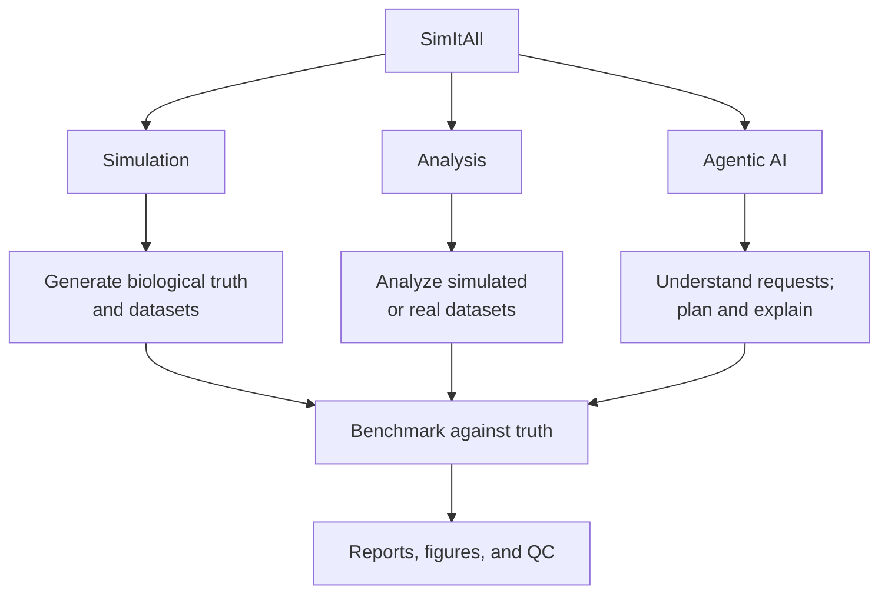

# SimItAll

`SimItAll` (SIMulate IT ALL) is an R framework for building
truth-aware genomics simulations, analyzing their outputs, and benchmarking
results against the truth used to generate them. It connects genome and
annotation generation, DNA read simulation and assembly, breeding populations,
GWAS and genomic selection, bulk and single-cell RNA-seq/eQTLs, ChIP-seq, and
reproducible reports through one R API. In short, simulate all seq analysis.

The aim of is be able to provide easy simulated data for researchers while also providing a platform where researchers can use an agentic AI model to ask questions and even have their data analyzed using known available software. `SimItAll` provides the
reproducible layer around those tools: it keeps inputs, parameters, random
seeds, provenance, and compatible truth outputs together so that an entire
study can be rerun and checked.

An optional local Shiny interface makes the retrieval-grounded agent easy to
use interactively. It runs in the user's own R session, does not require a
GitHub connection, and defaults to the free offline knowledge briefing:

```r
install.packages(c("shiny", "httr2"))
library(simitall)
launch_simitall_agent()
```

The interface uses a one-line chat-style prompt. **Include verified runnable
code** is enabled by default, so supported requests return their deterministic
R recipe directly in the answer panel; data-source and local-file options stay
under **Optional input details**. A chromosome-specific request keeps the
conservative real-data policy unless the prompt explicitly asks to simulate a
chromosome or the user explicitly selects synthetic inputs.

**Start here:** [Install](#install-simitall) | [Detailed tutorial](docs/TUTORIAL.md) | [Validation and benchmarks](docs/VALIDATION.md)

## Install simitall

SimItAll keeps R dependencies, Python modules, and external scientific
software outside this repository. Select a profile that matches the work you
need; `full` installs the supported union for the operating system.

```bash
git clone https://github.com/nirwan1265/simitall.git
cd simitall

# macOS or Linux
bash install_simitall_macos.sh population

# Windows PowerShell
powershell -ExecutionPolicy Bypass -File install_simitall_windows.ps1 -Profile population
```

| Profile | Includes |
| --- | --- |
| `minimal` | R package, free local agent, Shiny interface, and basic simulation dependencies |
| `population` | SimuPOP, breeding, phenotype simulation, GWAS/genomic-selection R packages, TASSEL, and GEMMA where the platform supports it |
| `omics` | Bulk RNA-seq, single-cell, ChIP-seq, and supporting R/Bioconductor packages |
| `sequencing` | ART, PBSIM/PBSIM3, Badread, Unicycler, QUAST, and helper tools |
| `full` | Every supported profile component for the current operating system |

TASSEL is installed from Bioconda in the `population` profile. GEMMA is added
on Linux and Intel macOS; native Windows and Apple Silicon users retain the
portable R mixed-model workflow and receive a clear GEMMA fallback message.
Use `check_simitall_dependencies("population")` after activation to inspect
what is available.

## What SimItAll Does

| `SIMULATE` | `ANALYZE` | `AGENTIC AI` |
| --- | --- | --- |
| Create genomes, annotations, reads, founder panels, pedigrees, populations, phenotypes, and multi-omics truth. | Run and benchmark assembly, GWAS, eQTL, and genomic-selection analyses against known simulated truth. | Retrieve project knowledge, identify missing inputs, propose a reviewable workflow, and provide deterministic package recipes when supported. |


```mermaid
flowchart TB
  S["SimItAll"]
  SIM["Simulation"]
  ANA["Analysis"]
  AGENT["Agentic AI"]
  SIMDESC["Generate biological truth<br/>and datasets"]
  ANADESC["Analyze simulated<br/>or real datasets"]
  AGENTDESC["Understand requests;<br/>plan and explain"]
  BENCH["Benchmark against truth"]
  OUTPUT["Reports, figures, and QC"]

  S --> SIM
  S --> ANA
  S --> AGENT
  SIM --> SIMDESC
  ANA --> ANADESC
  AGENT --> AGENTDESC
  SIMDESC --> BENCH
  ANADESC --> BENCH
  AGENTDESC --> BENCH
  BENCH --> OUTPUT
```

The agent is a planning and explanation layer, not an autonomous analysis
runner. The user remains in control of running code, downloads, and
simulations. Free offline retrieval is the default; optional Ollama inference
runs a local model with retrieved `SimItAll` context, while the OpenAI backend
is optional and paid.

## Simulate, Analyze, and Validate

SimItAll supports the complete study loop: create data with known truth, run
an analysis, and check the result against the truth and design requirements.
It can also analyze compatible user-supplied inputs, but real-data conclusions
remain the user's scientific responsibility.

| Study area | Simulations | Analyses and outputs |
| --- | --- | --- |
| **Genomes and populations** | Genomes, annotations, founder panels, pedigrees, designed crosses, NAM/MAGIC/RIL/NIL/DH populations, ancestry, recombination, and structural truth | Segregation, ancestry, breakpoint, LD, relatedness, and breeding-composition summaries |
| **Traits and association** | Quantitative, binary, count, ordinal, family-effect, and GxE traits with causal truth | GWAS, QTL/causal-truth recovery, calibration, kinship/PC adjustment, and genomic prediction/selection |
| **Bulk and single-cell transcriptomics** | Bulk RNA-seq, eQTLs, ASE, batches, cell types, pseudotime, dropout, ambient RNA, doublets, and cell-type eQTLs | Differential expression, donor-aware pseudobulk, eQTL benchmarking, clustering, PCA, volcano, and QC figures |
| **Chromatin** | ChIP-seq and ATAC-seq reads, peaks, matched controls, conditions, and differential-accessibility truth | Peak calling, differential peaks, enrichment/QC, and precision/recall/F1 against retained truth |
| **Sequencing and assembly** | Illumina short reads, PacBio HiFi/CLR reads, Nanopore reads, hybrid read sets, coverage grids, and synthetic references | Assembly with Unicycler, QUAST comparison, coverage/read-length QC, and truth-aware assembly metrics |

### Sequencing Platforms

Use `simitall_sequencing_profiles()` to see the validated platform labels:

- **Illumina:** `MiSeq`, `MiSeq i100`, `NextSeq 1000/2000`, and `NovaSeq X`.
- **PacBio:** `Sequel IIe HiFi`, `Revio HiFi`, and `Vega HiFi`.
- **Oxford Nanopore:** Nanopore simulation through Badread, with configurable
  error/length models for MinION-, GridION-, or PromethION-style study designs.

Platform labels select transparent simulator settings and defaults. They do not
claim to reproduce every current instrument chemistry; empirical error models
should be supplied when instrument-specific accuracy matters.

### Validation and Benchmarking

Validation lives in **[docs/VALIDATION.md](docs/VALIDATION.md)**, not on this
project overview page. It contains the reproducible figures, fixed-seed
benchmarks, source-data expectations, and interpretation boundaries.

Each supported workflow is also described by a four-part validation contract:

1. Simulation truth retained by the run.
2. Required result files.
3. Required figures.
4. Pass criteria for the programmed mechanism.

See [the validation-contract README](inst/agent/knowledge/validation_contracts/README.md)
for the contract rules and [docs/VALIDATION.md](docs/VALIDATION.md) for the
human-readable demonstrations.

## Capability Details

- Random genomes or reference-derived genomes with tandem and motif repeats
- Uniform, Poisson, or fixed repeat spacing with optional GC matching
- Haploid through polyploid genome copies with SNP and indel divergence
- Genes, CDS features, operons, promoters, TSSs, terminators, rRNA/tRNA
  clusters, riboswitches, CRISPR arrays, plasmids, and regulatory elements
- GWAS cohorts with LD blocks, recombination maps, subpopulations, and
  quantitative or binary phenotypes
- Mixed-model GWAS with kinship, principal components, fixed effects,
  Manhattan/QQ plots, and causal-variant recovery benchmarks
- GBLUP, RR-BLUP, Bayesian, and random-forest genomic prediction with
  leakage-aware cross-validation, parent selection, and crossing plans
- Advanced quantitative and binary phenotype architectures through
  `simplePHENOTYPES`
- Ordinal and count traits plus shared breeding-family effects through
  `simstudy`
- Direct, maternal, and paternal pedigree effects through `pedtricks`
- F1, F2, backcross, selfing, RIL, NIL, doubled-haploid, NAM, and MAGIC
  populations
- SimuPOP mating schemes through `reticulate`, with VCF-compatible genotype
  output and sample metadata
- Illumina reads with ART
- PacBio CLR and HiFi/CCS reads with PBSIM/PBSIM3
- Oxford Nanopore reads with Badread
- Hybrid assembly grids with Unicycler and evaluation with QUAST
- Standalone bulk RNA-seq experiments with technical, biological, or mixed
  replicates, even when no genotype data are available
- RNA-seq from the same GWAS individuals, with cis/trans eQTLs, condition and
  batch effects, genotype-by-condition interactions, latent confounders, and
  allele-specific expression
- eQTL association testing with causal-truth precision and recall summaries
- Standalone single-cell RNA-seq experiments with technical, biological, or
  mixed replicates
- Single-cell RNA-seq from GWAS donors with cell types, marker programs,
  pseudotime, cell-type-specific eQTLs, dropout, ambient RNA, and doublets
- Donor-by-cell-type pseudobulk and cell-type eQTL benchmarking without
  treating cells as independent biological replicates
- Annotation-aware TF, histone-mark, and nucleosome ChIP-seq with matched
  inputs, differential binding, FASTQ reads, peak truth, and publication plots

Truth outputs include FASTA, VCF, GFF3, BED, TSV, and JSON files. Functions
write results to user-selected output paths; generated analyses are not stored
inside the package source tree.

## Detailed tutorial

The full, step-by-step simulation guide is intentionally kept off this front
page so the project overview stays easy to scan. It includes runnable R
examples for genome and annotation generation, GWAS and traits, multi-chromosome
breeding, sequencing and assembly, bulk RNA-seq/eQTLs, single-cell RNA-seq, and
ChIP-seq.

**[Open the detailed simulation tutorial](docs/TUTORIAL.md)**

For generated figures, fixed-seed demonstrations, validation summaries, and
reproduction commands, see **[Results and Validation](docs/VALIDATION.md)**.

## Package layout

```text
simitall/
├── analysis/           paper-figure runners and generated output folders
├── docs/               detailed tutorial and validation documentation
├── R/                  package functions and internal simulation engines
├── man/                generated R help pages
├── inst/extdata/       lightweight manifests and demo files
├── tests/testthat/     automated tests
├── DESCRIPTION         package metadata and dependencies
├── NAMESPACE           generated exports
├── README.md           project overview, installation, and agent guide
├── docs/TUTORIAL.md    detailed simulation workflows
└── docs/VALIDATION.md  reproducible figures and validation notes
```

## Reproducibility and attribution

Set `seed` in each simulator and record tool versions for publication. The
package orchestrates external software; publications should cite both
`simitall` and the underlying tools used in an analysis, including ART, PBSIM
or PBSIM3, Badread, Unicycler, QUAST, SimuPOP, and simplePHENOTYPES as
applicable. Analyses that generate RNA-seq FASTQ files should also cite
`Rsubread`/`simReads`. Single-cell analyses using `backend = "splatter"`
should cite Splatter in addition to `simitall`. ChIP-seq analyses using
`backend = "chipsim"` should cite ChIPsim.

## Status

`simitall` is under active development. Simulated annotations and regulatory
elements are benchmarking truth, not biological claims. Large-genome and
high-coverage runs can require substantial memory, storage, and compute time.

## License

MIT
