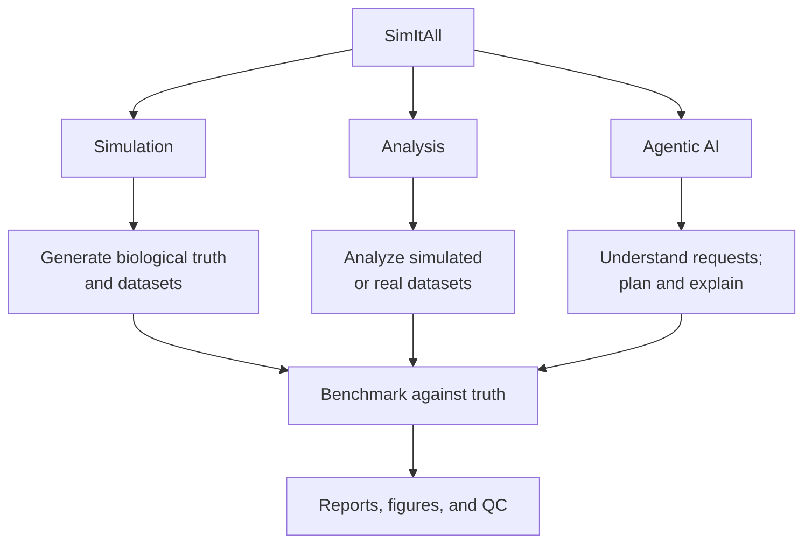
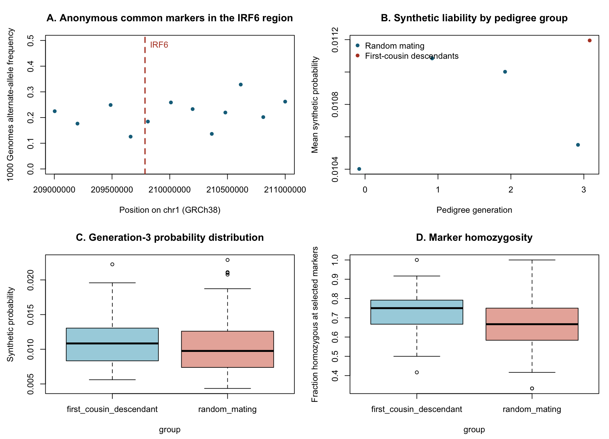

# SimItAll

`SimItAll` (SIMulate IT ALL) is an R framework for building
truth-aware genomics simulations, analyzing their outputs, and benchmarking
results against the truth used to generate them. It connects genome and
annotation generation, DNA read simulation and assembly, breeding populations,
GWAS and genomic selection, bulk and single-cell RNA-seq/eQTLs, ChIP-seq, and
reproducible reports through one R API. In short, simulate all seq analysis.

The aim of is be able to provide easy simulated data for researchers while also providing a platform where researchers can use an agentic AI model to ask questions and even have their data analyzed using known available software. `SimItAll` provides the
reproducible layer around those tools: it keeps inputs, parameters, random
seeds, provenance, and compatible truth outputs together so that an entire
study can be rerun and checked.

An optional local Shiny interface makes the retrieval-grounded agent easy to
use interactively. It runs in the user's own R session, does not require a
GitHub connection, and defaults to the free offline knowledge briefing:

```r
install.packages(c("shiny", "httr2"))
library(simitall)
launch_simitall_agent()
```

The interface uses a one-line chat-style prompt. **Include verified runnable
code** is enabled by default, so supported requests return their deterministic
R recipe directly in the answer panel; data-source and local-file options stay
under **Optional input details**.

**Start here:** [Install](#install-simitall) | [Detailed tutorial](docs/TUTORIAL.md) | [Results and validation](docs/VALIDATION.md)

## What simitall can do

| `SIMULATE` | `ANALYZE` | `AGENTIC AI` |
| --- | --- | --- |
| Create genomes, annotations, reads, founder panels, pedigrees, populations, phenotypes, and multi-omics truth. | Run and benchmark assembly, GWAS, eQTL, and genomic-selection analyses against known simulated truth. | Retrieve project knowledge, identify missing inputs, propose a reviewable workflow, and provide deterministic package recipes when supported. |


```mermaid
flowchart TB
  S["SimItAll"]
  SIM["Simulation"]
  ANA["Analysis"]
  AGENT["Agentic AI"]
  SIMDESC["Generate biological truth<br/>and datasets"]
  ANADESC["Analyze simulated<br/>or real datasets"]
  AGENTDESC["Understand requests;<br/>plan and explain"]
  BENCH["Benchmark against truth"]
  OUTPUT["Reports, figures, and QC"]

  S --> SIM
  S --> ANA
  S --> AGENT
  SIM --> SIMDESC
  ANA --> ANADESC
  AGENT --> AGENTDESC
  SIMDESC --> BENCH
  ANADESC --> BENCH
  AGENTDESC --> BENCH
  BENCH --> OUTPUT
```

The agent is an planning and an explanation layer, not an autonomous
analysis runner for now. Developments are taking place. The user remains in control of running code, downloads, and
simulations. Free offline retrieval is the default; optional Ollama inference
runs a local model with retrieved `SimItAll` context, while the OpenAI backend
is optional and paid.

## Worked examples

### 1. Human IRF6-region synthetic pedigree liability

**Question to the agent**

```r
answer <- simitall_ask(
  "I have a local GRCh38 IRF6-region VCF. Plan a synthetic multi-generation human pedigree with an inbreeding scenario and an IRF6-region liability figure.",
  provider = "local",
  data_source = "provided",
  include_code = TRUE,
  input_files = c(
    "data/raw/human_irf6/irf6_1kgp_grch38_chr1_209M_211M.vcf.gz",
    "data/raw/human_irf6/irf6_grch38_chr1_209M_211M.recombination_map.tsv"
  )
)
cat(answer$answer)
```

**Agent output**

The returned answer below is the local agent's deterministic, retrieval-grounded
plan. The `Grounding documents` list is intentionally omitted here to keep the
front page readable; it is still returned in R so users can inspect provenance.

<details>
<summary>View the IRF6 planning answer and full R script</summary>

**Proposed stages**

1. Define the founder haplotypes and a chromosome-specific recombination map.
2. Create a designed pedigree while retaining family labels, ancestry tracts,
   breakpoints, and map truth.
3. Validate IDs, parent IDs, unknown parents, pedigree cycles, aliases, and
   generations before simulating phenotype outcomes.

**Required inputs**

- A supplied founder/genotype panel, genetic map, mating design, and sample size.
- A pedigree table with unique `id`, `sire`, and `dam` columns; optional family,
  generation, sex, and source columns.

**Truth and QC outputs**

- Per-chromosome ancestry, breakpoints, founder contributions, heterozygosity,
  and LD/segregation QC.
- A validated pedigree, cross graph, family/generation summaries, and
  genotype-pedigree concordance checks when markers are available.

**Limitation**

This is a synthetic demonstration, not evidence that a simulated pedigree
reproduces human biology. The supplied VCF selects anonymous common-marker
frequencies only. The simulated liability effects and outcomes are illustrative,
not a clinical cleft-lip predictor or a claim of variant causality.

**Full R script returned by `include_code = TRUE`**

```r
#!/usr/bin/env Rscript

# Figure 11: synthetic IRF6-region pedigree-liability demonstration.
# This uses allele-frequency summaries from a public reference panel to choose
# anonymous marker positions. Effect sizes, environment, and phenotype outcomes
# are deliberately synthetic and must never be interpreted as clinical risk.

args <- commandArgs(trailingOnly = TRUE)
get_arg <- function(flag, default) {
  i <- match(flag, args, nomatch = 0L)
  if (!i || i == length(args)) default else args[i + 1L]
}
root <- normalizePath(file.path(dirname(sub("^--file=", "", grep("^--file=", commandArgs(), value = TRUE)[1L])), "..", ".."), mustWork = FALSE)
if (!dir.exists(root)) root <- normalizePath(".")
setwd(root)
data_dir <- get_arg("--data_dir", "data/raw/human_irf6")
out_dir <- get_arg("--out_dir", "analysis/results/human_irf6_synthetic_liability")
seed <- as.integer(get_arg("--seed", "81"))
dir.create(out_dir, recursive = TRUE, showWarnings = FALSE)
vcf <- file.path(data_dir, "irf6_1kgp_grch38_chr1_209M_211M.vcf.gz")
gff <- file.path(data_dir, "irf6_grch38_chr1_209M_211M.gff3")
stopifnot(file.exists(vcf), file.exists(gff), nzchar(Sys.which("bcftools")))
set.seed(seed)

# Obtain biallelic SNP allele frequencies without reading 3,202 individual
# genotypes into R. These positions are markers, not asserted disease variants.
query_file <- tempfile(fileext = ".tsv")
query_command <- paste(
  "bcftools query -f",
  shQuote("%CHROM\t%POS\t%ID\t%REF\t%ALT\t%INFO/AF\n"),
  shQuote(vcf), ">", shQuote(query_file)
)
if (system(query_command) != 0L) stop("bcftools query failed")
markers <- read.delim(query_file, header = FALSE, sep = "	", stringsAsFactors = FALSE)
names(markers) <- c("chromosome", "position_bp", "id", "ref", "alt", "af")
markers$af <- suppressWarnings(as.numeric(markers$af))
markers <- markers[
  is.finite(markers$af) & markers$af >= 0.10 & markers$af <= 0.40 &
    nchar(markers$ref) == 1L & nchar(markers$alt) == 1L & !grepl(",", markers$alt, fixed = TRUE),
]
if (nrow(markers) < 8L) stop("Too few common biallelic SNPs in the supplied IRF6 window")
marker_index <- unique(round(seq(1, nrow(markers), length.out = min(12L, nrow(markers)))))
markers <- markers[marker_index, ]
markers$marker_id <- paste0("IRF6_region_marker_", seq_len(nrow(markers)))
markers$synthetic_log_odds_effect <- c(0.45, rnorm(nrow(markers) - 1L, 0.12, 0.05))
write.table(markers, file.path(out_dir, "irf6_region_marker_truth.tsv"), sep = "	", row.names = FALSE, quote = FALSE)

L <- nrow(markers)
make_unrelated <- function(n) matrix(rbinom(n * L, 2, rep(markers$af, each = n)), nrow = n, byrow = FALSE)
gamete <- function(g) rbinom(length(g), 1, g / 2)
make_child <- function(a, b) gamete(a) + gamete(b)
make_random_generation <- function(pool, n) {
  out <- matrix(NA_real_, n, L)
  for (i in seq_len(n)) {
    parents <- sample(seq_len(nrow(pool)), 2L, replace = TRUE)
    out[i, ] <- make_child(pool[parents[1L], ], pool[parents[2L], ])
  }
  out
}

# A random-mating lineage gives three comparison generations.
g0 <- make_unrelated(160L)
g1 <- make_random_generation(g0, 160L)
g2 <- make_random_generation(g1, 160L)
g3 <- make_random_generation(g2, 160L)

# Build first-cousin offspring from two siblings who each mate an unrelated
# partner. Their descendants share one grandparental pair; F = 1/16 in the
# idealized pedigree used here.
n_families <- 40L
grandparents <- make_unrelated(2L * n_families)
external <- make_unrelated(2L * n_families)
cousin_offspring <- matrix(NA_real_, n_families, L)
for (i in seq_len(n_families)) {
  grandparents_i <- grandparents[c(2L * i - 1L, 2L * i), , drop = FALSE]
  sibling_a <- make_child(grandparents_i[1L, ], grandparents_i[2L, ])
  sibling_b <- make_child(grandparents_i[1L, ], grandparents_i[2L, ])
  cousin_a <- make_child(sibling_a, external[2L * i - 1L, ])
  cousin_b <- make_child(sibling_b, external[2L * i, ])
  cousin_offspring[i, ] <- make_child(cousin_a, cousin_b)
}

summarize_group <- function(geno, group, generation, F) {
  score <- as.vector(geno %*% markers$synthetic_log_odds_effect) +
    0.75 * F + rnorm(nrow(geno), 0, 0.20)
  probability <- plogis(qlogis(0.005) + score)
  data.frame(
    sample = paste0(group, "_", seq_len(nrow(geno))), group = group,
    generation = generation, theoretical_inbreeding_F = F,
    marker_homozygosity = rowMeans(geno == 0 | geno == 2),
    synthetic_liability = score, synthetic_cleft_probability = probability,
    stringsAsFactors = FALSE
  )
}
individuals <- rbind(
  summarize_group(g0, "random_mating", 0L, 0),
  summarize_group(g1, "random_mating", 1L, 0),
  summarize_group(g2, "random_mating", 2L, 0),
  summarize_group(g3, "random_mating", 3L, 0),
  summarize_group(cousin_offspring, "first_cousin_descendant", 3L, 1 / 16)
)
write.table(individuals, file.path(out_dir, "synthetic_pedigree_liability.tsv"), sep = "	", row.names = FALSE, quote = FALSE)
summary <- aggregate(cbind(synthetic_cleft_probability, marker_homozygosity) ~ group + generation + theoretical_inbreeding_F, individuals, mean)
summary$n <- as.integer(table(interaction(individuals$group, individuals$generation, individuals$theoretical_inbreeding_F, drop = TRUE)))
write.table(summary, file.path(out_dir, "synthetic_pedigree_liability_summary.tsv"), sep = "	", row.names = FALSE, quote = FALSE)

png(file.path(out_dir, "figure11_human_irf6_synthetic_liability.png"), width = 1800, height = 1300, res = 180)
par(mfrow = c(2, 2), mar = c(4.5, 4.5, 3.5, 1))
plot(markers$position_bp, markers$af, pch = 16, col = "#156E8A", ylim = c(0, 0.5), xlab = "Position on chr1 (GRCh38)", ylab = "1000 Genomes alternate-allele frequency", main = "A. Anonymous common markers in the IRF6 region")
abline(v = 209785617, col = "#B4422B", lty = 2, lwd = 2)
text(209785617, 0.48, "IRF6", pos = 4, col = "#B4422B")
plot(summary$generation + ifelse(summary$group == "first_cousin_descendant", 0.08, -0.08), summary$synthetic_cleft_probability, pch = 16, col = ifelse(summary$group == "random_mating", "#156E8A", "#B4422B"), xaxt = "n", xlab = "Pedigree generation", ylab = "Mean synthetic probability", main = "B. Synthetic liability by pedigree group")
axis(1, at = 0:3)
legend("topleft", legend = c("Random mating", "First-cousin descendants"), col = c("#156E8A", "#B4422B"), pch = 16, bty = "n")
boxplot(synthetic_cleft_probability ~ group, data = individuals[individuals$generation == 3L, ], col = c("#A7D3E0", "#E9B2A8"), ylab = "Synthetic probability", main = "C. Generation-3 probability distribution")
boxplot(marker_homozygosity ~ group, data = individuals[individuals$generation == 3L, ], col = c("#A7D3E0", "#E9B2A8"), ylab = "Fraction homozygous at selected markers", main = "D. Marker homozygosity")
dev.off()

metadata <- list(seed = seed, reference = "GRCh38 chr1:209,000,000-211,000,000", gene = "IRF6", marker_count = L, pedigree = "random-mating generations 0-3 plus synthetic first-cousin descendants at generation 3", limitation = "Synthetic liability effects are illustrative only; this is not a clinical predictor or a claim that selected markers cause cleft lip.")
if (requireNamespace("jsonlite", quietly = TRUE)) jsonlite::write_json(metadata, file.path(out_dir, "metadata.json"), pretty = TRUE, auto_unbox = TRUE)
cat("Completed synthetic IRF6-region pedigree-liability demonstration:
", normalizePath(out_dir), "
", sep = "")
```

Expected outputs are marker-truth, individual synthetic-liability, and group
summary TSV files; a metadata JSON file; and the validation figure.

</details>

```bash
Rscript analysis/paper_fig/fig11_human_irf6_synthetic_liability.R \
  --data_dir data/raw/human_irf6 \
  --out_dir analysis/results/human_irf6_synthetic_liability --seed 81
```



**What this figure tests, and did it work?**

- **Panel A** checks that the runner selected common, biallelic markers from
  the supplied GRCh38 `chr1:209-211 Mb` VCF window and places the annotated
  `IRF6` coordinate in that same window. It does not test disease-causing
  variants.
- **Panels B and C** check the programmed synthetic liability model. The
  first-cousin-descendant group has `F = 1/16` and is assigned an explicit
  positive inbreeding contribution, so its mean synthetic probability is
  expected to be higher than the generation-3 random-mating comparison.
- **Panel D** independently checks the pedigree/genotype mechanism: the
  first-cousin-descendant group should be more homozygous at the selected
  markers than the random-mating group.

For the fixed seed shown, both programmed checks pass: the first-cousin group
has a higher mean synthetic probability in panel B and a higher median marker
homozygosity in panel D. That validates agreement with this simulation's
*programmed truth*; it does not validate a real IRF6 disease mechanism or
human clinical risk prediction.

### 2. Maize NAM planning recipe

**Question to the agent**

```r
answer <- simitall_ask(
  "Plan a synthetic 500-line maize NAM population for chromosome 10 with a high-LD region, GWAS, RNA-seq, and genomic selection.",
  provider = "local",
  data_source = "synthetic",
  include_code = TRUE
)
cat(answer$answer)
```

**Agent output**

The local agent identifies the linked sequence: founder panel and map, NAM
population, trait/GWAS, RNA-seq/eQTL, then genomic selection. The lengthy
`Grounding documents` provenance list is omitted here, but remains part of the
answer printed in R.

<details>
<summary>View the NAM planning answer and full R recipe</summary>

**Proposed stages**

1. Define synthetic or supplied founder haplotypes and a chromosome-specific
   recombination map.
2. Simulate the NAM population with family labels, ancestry tracts,
   breakpoints, and VCF truth.
3. Simulate a phenotype, run family-aware GWAS, and retain phenotype/QTN truth.
4. Simulate bulk RNA-seq from the same NAM genotypes and benchmark eQTLs.
5. Use family-aware cross-validation and genomic selection to select a diverse
   set of parents and crosses.

**Full R recipe returned by `include_code = TRUE`**

```r
library(simitall)

set.seed(2026)
dir.create("results/maize_nam", recursive = TRUE, showWarnings = FALSE)

# 1. Build eight aligned founders for one 100 Mb chromosome.
panel <- "results/maize_nam/founders_chr10.fa"
generate_random_haplotype_panel(
  out_fa = panel, n_haplotypes = 8, length = 100000000,
  n_chromosomes = 1, snp_rate = 0.001, indel_rate = 0, seed = 101
)
# Label the single simulated chromosome as chr10 for the map and VCF.
panel_lines <- readLines(panel)
headers <- grepl("^>", panel_lines)
panel_lines[headers] <- paste0(panel_lines[headers], "|chr10")
writeLines(panel_lines, panel)

# 2. Make a chromosome-specific genetic map.
# Lower cM/Mb from 45-55 Mb suppresses recombination and creates high LD.
genome_bp <- 100000000L
positions <- sort(unique(c(seq.int(1L, genome_bp, by = 1000000L), genome_bp)))
midpoints <- head(positions, -1L) + diff(positions) / 2
rate_cm_per_mb <- ifelse(midpoints >= 45000000 & midpoints <= 55000000, 0.05, 1.0)
recomb_map <- data.frame(
  chromosome = "chr10", pos_bp = positions,
  cM = c(0, cumsum(diff(positions) * rate_cm_per_mb / 1e6))
)
map_file <- "results/maize_nam/chr10_recombination_map.tsv"
write.table(recomb_map, map_file, sep = "	", row.names = FALSE, quote = FALSE)

# 3. Simulate the NAM lines and retain ancestry, breakpoint, and VCF truth.
nam_prefix <- "results/maize_nam/nam500"
simulate_breeding(
  haplotype_fa = panel, out_prefix = nam_prefix, scheme = "NAM",
  founders = paste0("hap", 1:8, collapse = ","), n_offspring = 500,
  recomb_map_in = map_file, vcf_out = paste0(nam_prefix, ".vcf"),
  breakpoints_out = paste0(nam_prefix, ".breakpoints.tsv"),
  ancestry_out = paste0(nam_prefix, ".ancestry.tsv"),
  recomb_map_out = paste0(nam_prefix, ".realized_map.tsv"), seed = 202
)

# 4. Simulate a quantitative trait directly from the NAM VCF.
trait_prefix <- "results/maize_nam/trait"
simulate_phenotypes(
  geno_file = paste0(nam_prefix, ".vcf"), out_prefix = trait_prefix,
  heritability = 0.6, n_add_qtn = 20, n_dom_qtn = 5, n_epi_qtn = 2,
  export_qtn = TRUE, seed = 303
)
# Add NAM family labels for family-aware GWAS and genomic-selection validation.
pheno <- read.delim(paste0(trait_prefix, ".pheno.tsv"), check.names = FALSE)
names(pheno)[1] <- "sample"
families <- read.delim(paste0(nam_prefix, ".meta.tsv"), check.names = FALSE)
pheno <- merge(pheno, families[, c("sample", "family")], by = "sample", all.x = TRUE)
pheno_file <- paste0(trait_prefix, ".with_family.tsv")
write.table(pheno, pheno_file, sep = "	", row.names = FALSE, quote = FALSE)
trait <- setdiff(names(pheno)[vapply(pheno, is.numeric, logical(1))], character())[1]

# 5. Analyze the actual NAM VCF. This is not simulate_gwas_cohort(), which creates a separate cohort.
gwas <- analyze_gwas(
  genotype_file = paste0(nam_prefix, ".vcf"), phenotype = pheno_file,
  out_prefix = "results/maize_nam/gwas", trait = trait,
  fixed_effects = "family", n_pcs = 3, min_maf = 0.05
)
plot_gwas_results(gwas$paths$results, "results/maize_nam/gwas_plot")

# 6. Simulate bulk RNA-seq from these same 500 NAM genotypes and test eQTL recovery.
rna <- simulate_rnaseq_from_gwas(
  genotype_file = paste0(nam_prefix, ".vcf"),
  out_prefix = "results/maize_nam/rnaseq", sample_metadata = pheno_file,
  n_genes = 1000, n_cis_eqtl = 100, n_trans_eqtl = 25,
  condition_levels = c("control", "stress"),
  batch_levels = c("batch1", "batch2"), seed = 404
)
benchmark_eqtl(
  genotype_file = paste0(nam_prefix, ".vcf"),
  expression_file = rna$expression, sample_metadata = rna$sample_metadata,
  truth_file = rna$eqtl_truth, out_prefix = "results/maize_nam/eqtl"
)

# 7. Evaluate prediction with family-aware CV, then make a diverse parent/cross plan.
cv <- cross_validate_genomic_prediction(
  genotype_file = paste0(nam_prefix, ".vcf"), phenotype = pheno_file,
  trait = trait, model = "gblup", folds = 5, split = "group",
  group = "family", seed = 505
)
selection <- run_genomic_selection(
  genotype_file = paste0(nam_prefix, ".vcf"), phenotype = pheno_file,
  out_prefix = "results/maize_nam/selection", trait = trait, model = "gblup",
  n_parents = 12, n_crosses = 30, mating = "minimum_kinship",
  diversity_penalty = 0.25, family_data = pheno_file, family_col = "family",
  max_per_family = 3, seed = 505
)
```

**Expected outputs**

- Synthetic chromosome-10 founder FASTA and recombination map.
- NAM VCF, metadata, ancestry, breakpoints, and realized-map truth files.
- Phenotype/QTN outputs, GWAS table and plot, RNA-seq count/eQTL truth and
  benchmark results, plus cross-validation and genomic-selection outputs.

**Limitation**

This example intentionally generates synthetic founders. It must not be
interpreted as a simulation of named real NAM varieties; replace the founder
panel and recombination map with measured resources for organism-level claims.

</details>

See the [detailed NAM workflow](docs/TUTORIAL.md#46-nam-and-magic-populations)
and [validation examples](docs/VALIDATION.md) for output expectations.

**How to judge the NAM result after running it**

- The map should have a much smaller cumulative-cM slope from **45-55 Mb**
  than in the flanking intervals. This is the deliberately programmed
  recombination cold spot.
- The ancestry and breakpoint truth files should show fewer recombination
  breakpoints in that interval, and genotype LD should be higher there than in
  the flanks. Those are the direct checks that the intended high-LD region was
  created.
- The metadata should contain 500 final lines with NAM family labels; the VCF,
  phenotype table, RNA-seq metadata, and genomic-selection inputs should all
  use those same sample IDs.
- GWAS, eQTL, and genomic-selection outputs test that the downstream analyses
  can consume one consistent simulated cohort. The current breeding-first NAM
  route does not yet produce the standardized causal-truth schema required for
  a quantitative `benchmark_gwas()` recovery score.

The NAM block in this README is a verified recipe, but it is not yet a
fixed-seed completed 100-Mb validation result with a figure. We therefore
cannot honestly label it a scientific "pass" yet. Its recipe-generation path
is tested; after the full run, the map, breakpoint, LD, sample-ID, and
downstream-output checks above determine whether the requested design passed.

## What it can simulate

- Random genomes or reference-derived genomes with tandem and motif repeats
- Uniform, Poisson, or fixed repeat spacing with optional GC matching
- Haploid through polyploid genome copies with SNP and indel divergence
- Genes, CDS features, operons, promoters, TSSs, terminators, rRNA/tRNA
  clusters, riboswitches, CRISPR arrays, plasmids, and regulatory elements
- GWAS cohorts with LD blocks, recombination maps, subpopulations, and
  quantitative or binary phenotypes
- Mixed-model GWAS with kinship, principal components, fixed effects,
  Manhattan/QQ plots, and causal-variant recovery benchmarks
- GBLUP, RR-BLUP, Bayesian, and random-forest genomic prediction with
  leakage-aware cross-validation, parent selection, and crossing plans
- Advanced quantitative and binary phenotype architectures through
  `simplePHENOTYPES`
- Ordinal and count traits plus shared breeding-family effects through
  `simstudy`
- Direct, maternal, and paternal pedigree effects through `pedtricks`
- F1, F2, backcross, selfing, RIL, NIL, doubled-haploid, NAM, and MAGIC
  populations
- SimuPOP mating schemes through `reticulate`, with VCF-compatible genotype
  output and sample metadata
- Illumina reads with ART
- PacBio CLR and HiFi/CCS reads with PBSIM/PBSIM3
- Oxford Nanopore reads with Badread
- Hybrid assembly grids with Unicycler and evaluation with QUAST
- Standalone bulk RNA-seq experiments with technical, biological, or mixed
  replicates, even when no genotype data are available
- RNA-seq from the same GWAS individuals, with cis/trans eQTLs, condition and
  batch effects, genotype-by-condition interactions, latent confounders, and
  allele-specific expression
- eQTL association testing with causal-truth precision and recall summaries
- Standalone single-cell RNA-seq experiments with technical, biological, or
  mixed replicates
- Single-cell RNA-seq from GWAS donors with cell types, marker programs,
  pseudotime, cell-type-specific eQTLs, dropout, ambient RNA, and doublets
- Donor-by-cell-type pseudobulk and cell-type eQTL benchmarking without
  treating cells as independent biological replicates
- Annotation-aware TF, histone-mark, and nucleosome ChIP-seq with matched
  inputs, differential binding, FASTQ reads, peak truth, and publication plots

Truth outputs include FASTA, VCF, GFF3, BED, TSV, and JSON files. Functions
write results to user-selected output paths; generated analyses are not stored
inside the package source tree.

## Detailed tutorial

The full, step-by-step simulation guide is intentionally kept off this front
page so the project overview stays easy to scan. It includes runnable R
examples for genome and annotation generation, GWAS and traits, multi-chromosome
breeding, sequencing and assembly, bulk RNA-seq/eQTLs, single-cell RNA-seq, and
ChIP-seq.

**[Open the detailed simulation tutorial](docs/TUTORIAL.md)**

For generated figures, fixed-seed demonstrations, validation summaries, and
reproduction commands, see **[Results and Validation](docs/VALIDATION.md)**.

## Package layout

```text
simitall/
├── analysis/           paper-figure runners and generated output folders
├── docs/               detailed tutorial and validation documentation
├── R/                  package functions and internal simulation engines
├── man/                generated R help pages
├── inst/extdata/       lightweight manifests and demo files
├── tests/testthat/     automated tests
├── DESCRIPTION         package metadata and dependencies
├── NAMESPACE           generated exports
├── README.md           project overview, installation, and agent guide
├── docs/TUTORIAL.md    detailed simulation workflows
└── docs/VALIDATION.md  reproducible figures and validation notes
```

## Reproducibility and attribution

Set `seed` in each simulator and record tool versions for publication. The
package orchestrates external software; publications should cite both
`simitall` and the underlying tools used in an analysis, including ART, PBSIM
or PBSIM3, Badread, Unicycler, QUAST, SimuPOP, and simplePHENOTYPES as
applicable. Analyses that generate RNA-seq FASTQ files should also cite
`Rsubread`/`simReads`. Single-cell analyses using `backend = "splatter"`
should cite Splatter in addition to `simitall`. ChIP-seq analyses using
`backend = "chipsim"` should cite ChIPsim.

## Status

`simitall` is under active development. Simulated annotations and regulatory
elements are benchmarking truth, not biological claims. Large-genome and
high-coverage runs can require substantial memory, storage, and compute time.

## License

MIT
