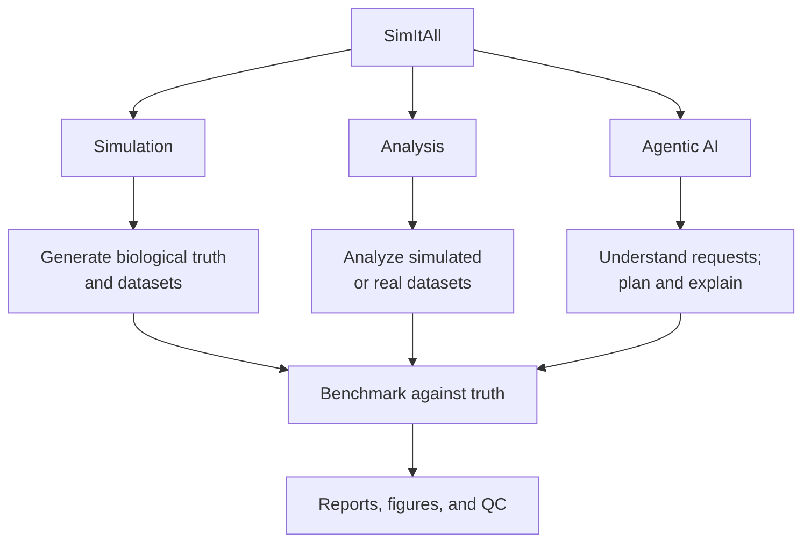

# SimItAll

`SimItAll` (SIMulate IT ALL) is an R-first framework for building linked,
truth-aware genomics simulations, analyzing their outputs, and benchmarking
results against the truth used to generate them. It connects genome and
annotation generation, DNA read simulation and assembly, breeding populations,
GWAS and genomic selection, bulk and single-cell RNA-seq/eQTLs, ChIP-seq, and
reproducible reports through one R API.

The aim is not to replace mature scientific software. `SimItAll` provides the
reproducible layer around those tools: it keeps inputs, parameters, random
seeds, provenance, and compatible truth outputs together so that an entire
study can be rerun and checked.

An optional local Shiny interface makes the retrieval-grounded agent easy to
use interactively. It runs in the user's own R session, does not require a
GitHub connection, and defaults to the free offline knowledge briefing:

```r
install.packages(c("shiny", "httr2"))
library(simitall)
launch_simitall_agent()
```

**Start here:** [Install](#install-simitall) | [Detailed tutorial](docs/TUTORIAL.md) | [Results and validation](docs/VALIDATION.md)

## What simitall can do

| `SIMULATE` | `ANALYZE` | `AGENTIC AI` |
| --- | --- | --- |
| Create genomes, annotations, reads, founder panels, pedigrees, populations, phenotypes, and multi-omics truth. | Run and benchmark assembly, GWAS, eQTL, and genomic-selection analyses against known simulated truth. | Retrieve project knowledge, identify missing inputs, propose a reviewable workflow, and provide deterministic package recipes when supported. |


```mermaid
flowchart TB
  S["SimItAll"]
  SIM["Simulation"]
  ANA["Analysis"]
  AGENT["Agentic AI"]
  SIMDESC["Generate biological truth<br/>and datasets"]
  ANADESC["Analyze simulated<br/>or real datasets"]
  AGENTDESC["Understand requests;<br/>plan and explain"]
  BENCH["Benchmark against truth"]
  OUTPUT["Reports, figures, and QC"]

  S --> SIM
  S --> ANA
  S --> AGENT
  SIM --> SIMDESC
  ANA --> ANADESC
  AGENT --> AGENTDESC
  SIMDESC --> BENCH
  ANADESC --> BENCH
  AGENTDESC --> BENCH
  BENCH --> OUTPUT
```

The agent is an orchestration and explanation layer, not an autonomous
analysis runner. The user remains in control of running code, downloads, and
simulations. Free offline retrieval is the default; optional Ollama inference
runs a local model with retrieved `SimItAll` context, while the OpenAI backend
is optional and paid.

## Worked examples

### 1. Human IRF6-region synthetic pedigree liability

**Question to the agent**

```r
answer <- simitall_ask(
  "I have a local GRCh38 IRF6-region VCF. Plan a synthetic multi-generation human pedigree with an inbreeding scenario and an IRF6-region liability figure.",
  provider = "local",
  data_source = "provided",
  include_code = TRUE,
  input_files = c(
    "data/raw/human_irf6/irf6_1kgp_grch38_chr1_209M_211M.vcf.gz",
    "data/raw/human_irf6/irf6_grch38_chr1_209M_211M.recombination_map.tsv"
  )
)
cat(answer$answer)
```

**Agent output**

The returned answer below is the local agent's deterministic, retrieval-grounded
plan. The `Grounding documents` list is intentionally omitted here to keep the
front page readable; it is still returned in R so users can inspect provenance.

<details>
<summary>View the IRF6 planning answer</summary>

**Proposed stages**

1. Define the founder haplotypes and a chromosome-specific recombination map.
2. Create a designed pedigree while retaining family labels, ancestry tracts,
   breakpoints, and map truth.
3. Validate IDs, parent IDs, unknown parents, pedigree cycles, aliases, and
   generations before simulating phenotype outcomes.

**Required inputs**

- A supplied founder/genotype panel, genetic map, mating design, and sample size.
- A pedigree table with unique `id`, `sire`, and `dam` columns; optional family,
  generation, sex, and source columns.

**Truth and QC outputs**

- Per-chromosome ancestry, breakpoints, founder contributions, heterozygosity,
  and LD/segregation QC.
- A validated pedigree, cross graph, family/generation summaries, and
  genotype-pedigree concordance checks when markers are available.

**Limitation**

This is a synthetic demonstration, not evidence that a simulated pedigree
reproduces human biology. The supplied VCF selects anonymous common-marker
frequencies only. The simulated liability effects and outcomes are illustrative,
not a clinical cleft-lip predictor or a claim of variant causality.

**Verified execution recipe**

With `include_code = TRUE`, the agent appends this runner and then returns the
complete versioned R implementation from
`analysis/paper_fig/fig11_human_irf6_synthetic_liability.R`:

```r
system2("Rscript", c(
  "analysis/paper_fig/fig11_human_irf6_synthetic_liability.R",
  "--data_dir", "data/raw/human_irf6",
  "--out_dir", "analysis/results/human_irf6_synthetic_liability",
  "--seed", "81"
))
```

Expected outputs are marker-truth, individual synthetic-liability, and group
summary TSV files; a metadata JSON file; and the validation figure.

</details>

```bash
Rscript analysis/paper_fig/fig11_human_irf6_synthetic_liability.R \
  --data_dir data/raw/human_irf6 \
  --out_dir analysis/results/human_irf6_synthetic_liability --seed 81
```


### 2. Maize NAM planning recipe

**Question to the agent**

```r
answer <- simitall_ask(
  "Plan a synthetic 500-line maize NAM population for chromosome 10 with a high-LD region, GWAS, RNA-seq, and genomic selection.",
  provider = "local",
  data_source = "synthetic",
  include_code = TRUE
)
cat(answer$answer)
```

**Grounded answer and output**

For this supported request, `include_code = TRUE` appends a deterministic,
package-verified R recipe rather than relying on model-written code. The recipe
creates synthetic founders, a chromosome-specific recombination map with a
low-recombination/high-LD interval, a 500-line NAM population, a phenotype,
family-aware GWAS, RNA-seq/eQTL outputs, and genomic-selection results.

When real NAM founder haplotypes and a genetic map are available, replace the
synthetic panel explicitly. The agent must not call synthetic founders real NAM
varieties. See the [detailed NAM workflow](docs/TUTORIAL.md#46-nam-and-magic-populations)
and [validation examples](docs/VALIDATION.md) for output expectations.

## What it can simulate

- Random genomes or reference-derived genomes with tandem and motif repeats
- Uniform, Poisson, or fixed repeat spacing with optional GC matching
- Haploid through polyploid genome copies with SNP and indel divergence
- Genes, CDS features, operons, promoters, TSSs, terminators, rRNA/tRNA
  clusters, riboswitches, CRISPR arrays, plasmids, and regulatory elements
- GWAS cohorts with LD blocks, recombination maps, subpopulations, and
  quantitative or binary phenotypes
- Mixed-model GWAS with kinship, principal components, fixed effects,
  Manhattan/QQ plots, and causal-variant recovery benchmarks
- GBLUP, RR-BLUP, Bayesian, and random-forest genomic prediction with
  leakage-aware cross-validation, parent selection, and crossing plans
- Advanced quantitative and binary phenotype architectures through
  `simplePHENOTYPES`
- Ordinal and count traits plus shared breeding-family effects through
  `simstudy`
- Direct, maternal, and paternal pedigree effects through `pedtricks`
- F1, F2, backcross, selfing, RIL, NIL, doubled-haploid, NAM, and MAGIC
  populations
- SimuPOP mating schemes through `reticulate`, with VCF-compatible genotype
  output and sample metadata
- Illumina reads with ART
- PacBio CLR and HiFi/CCS reads with PBSIM/PBSIM3
- Oxford Nanopore reads with Badread
- Hybrid assembly grids with Unicycler and evaluation with QUAST
- Standalone bulk RNA-seq experiments with technical, biological, or mixed
  replicates, even when no genotype data are available
- RNA-seq from the same GWAS individuals, with cis/trans eQTLs, condition and
  batch effects, genotype-by-condition interactions, latent confounders, and
  allele-specific expression
- eQTL association testing with causal-truth precision and recall summaries
- Standalone single-cell RNA-seq experiments with technical, biological, or
  mixed replicates
- Single-cell RNA-seq from GWAS donors with cell types, marker programs,
  pseudotime, cell-type-specific eQTLs, dropout, ambient RNA, and doublets
- Donor-by-cell-type pseudobulk and cell-type eQTL benchmarking without
  treating cells as independent biological replicates
- Annotation-aware TF, histone-mark, and nucleosome ChIP-seq with matched
  inputs, differential binding, FASTQ reads, peak truth, and publication plots

Truth outputs include FASTA, VCF, GFF3, BED, TSV, and JSON files. Functions
write results to user-selected output paths; generated analyses are not stored
inside the package source tree.

## Detailed tutorial

The full, step-by-step simulation guide is intentionally kept off this front
page so the project overview stays easy to scan. It includes runnable R
examples for genome and annotation generation, GWAS and traits, multi-chromosome
breeding, sequencing and assembly, bulk RNA-seq/eQTLs, single-cell RNA-seq, and
ChIP-seq.

**[Open the detailed simulation tutorial](docs/TUTORIAL.md)**

For generated figures, fixed-seed demonstrations, validation summaries, and
reproduction commands, see **[Results and Validation](docs/VALIDATION.md)**.

## Package layout

```text
simitall/
├── analysis/           paper-figure runners and generated output folders
├── docs/               detailed tutorial and validation documentation
├── R/                  package functions and internal simulation engines
├── man/                generated R help pages
├── inst/extdata/       lightweight manifests and demo files
├── tests/testthat/     automated tests
├── DESCRIPTION         package metadata and dependencies
├── NAMESPACE           generated exports
├── README.md           project overview, installation, and agent guide
├── docs/TUTORIAL.md    detailed simulation workflows
└── docs/VALIDATION.md  reproducible figures and validation notes
```

## Reproducibility and attribution

Set `seed` in each simulator and record tool versions for publication. The
package orchestrates external software; publications should cite both
`simitall` and the underlying tools used in an analysis, including ART, PBSIM
or PBSIM3, Badread, Unicycler, QUAST, SimuPOP, and simplePHENOTYPES as
applicable. Analyses that generate RNA-seq FASTQ files should also cite
`Rsubread`/`simReads`. Single-cell analyses using `backend = "splatter"`
should cite Splatter in addition to `simitall`. ChIP-seq analyses using
`backend = "chipsim"` should cite ChIPsim.

## Status

`simitall` is under active development. Simulated annotations and regulatory
elements are benchmarking truth, not biological claims. Large-genome and
high-coverage runs can require substantial memory, storage, and compute time.

## License

MIT
