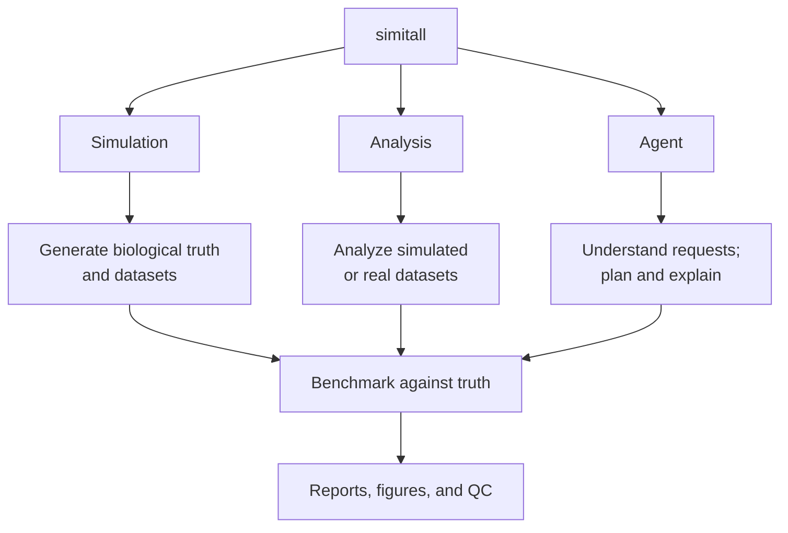

# simitall

`simitall` (SIMulate IT ALL) is an R-first framework for creating coordinated,
truth-aware genomics simulations and evaluating the analyses performed on them.
It connects genome and annotation generation, DNA read simulation and hybrid
assembly, breeding populations, GWAS and genomic selection, bulk and
single-cell RNA-seq/eQTLs, ChIP-seq, and benchmark reports through one
reproducible R API.

The project is designed to make a complete study easier to reason about: define
biological truth once, generate linked data modalities from the same individuals
where appropriate, run an analysis, and compare its result with the known
truth. `simitall` orchestrates established scientific tools rather than trying
to replace them, while keeping parameters, seeds, provenance, and compatible
truth outputs together.

**Start here:** [Install](#1-install-simitall) | [Detailed tutorial](docs/TUTORIAL.md) | [Results and validation](docs/VALIDATION.md) | [Agentic planning and chat](#agentic-planning-and-chat)

## What simitall can do

- **Simulate:** genomes, annotations, reads, assemblies, founder panels,
  breeding populations, phenotypes, GWAS cohorts, RNA-seq, single-cell RNA-seq,
  eQTLs, and ChIP-seq.
- **Analyze and benchmark:** GWAS, eQTL, genomic-selection, and assembly
  outputs against the simulated causal, ancestry, feature, or reference truth.
- **Plan with an agent:** retrieve versioned project knowledge, identify missing
  inputs, propose a reviewable workflow, and optionally provide a
  package-verified R recipe.

## Results and validation

Reproducible example figures, their input settings, source-data tables, and the
scope of each validation are collected in **[Results and Validation](docs/VALIDATION.md)**.
The page distinguishes implementation checks against known synthetic truth from
claims of biological realism, and links each figure to the script that generated
it.

### Human IRF6-region example

`simitall` includes a reproducible, **synthetic** human-pedigree demonstration
for an `IRF6`-centered GRCh38 chromosome-1 window. It reads a locally supplied
1000 Genomes VCF only to obtain anonymous common-marker frequencies, constructs
random-mating and first-cousin-descendant pedigree branches, and writes marker
truth, synthetic liabilities, probability summaries, and a four-panel figure.

The raw human inputs remain local under `data/raw/human_irf6/` and are ignored
by Git. This example is designed to test data provenance, inheritance,
inbreeding summaries, and figure generation. Its effects and probabilities are
explicitly simulated: it is **not** a clinical cleft-lip predictor, a claim of
variant causality, or a substitute for genetic counselling.

```bash
Rscript analysis/paper_fig/fig11_human_irf6_synthetic_liability.R \
  --data_dir data/raw/human_irf6 \
  --out_dir analysis/results/human_irf6_synthetic_liability --seed 81
```

See the [detailed tutorial](docs/TUTORIAL.md#human-irf6-region-synthetic-pedigree-liability-example)
for interpretation and the [validation page](docs/VALIDATION.md#synthetic-human-irf6-region-pedigree-liability)
for the result figure and output definitions.

## Agentic planning and chat

The `simitall` agent is a **retrieval-grounded planning assistant**, not an
unreviewed autonomous analysis runner. It uses the versioned knowledge library
shipped with the package to interpret a question, prioritize relevant workflows
and species notes, flag missing inputs, and return the documents that grounded
its response. It can help formulate a runnable plan, but users remain in
control of executing simulations and analyses.

The default chat mode is free and offline: it returns a transparent local
evidence briefing without an API key, account, model download, or GitHub
connection.

```r
library(simitall)

answer <- simitall_ask(
  "Plan a multi-chromosome maize NAM population for GWAS and genomic selection."
)
print(answer)
```

For local natural-language inference, use a free Ollama model installed on the
same computer. The model receives retrieved project context, while the package
keeps the grounding documents alongside the answer:

```bash
ollama pull llama3.2
```

```r
answer <- simitall_ask(
  "What should I simulate first for a maize NAM GWAS and RNA-seq study?",
  provider = "ollama",
  data_source = "synthetic",
  include_code = TRUE
)
```

`include_code = TRUE` requests a package-verified recipe only when the input
requirements have been resolved. If a user names a real panel or resource that
is not available locally, the agent should ask for its path or explicitly offer
a synthetic alternative instead of silently substituting toy data. See
[Agent Knowledge Base](#agent-knowledge-base) for the guardrails and backends.

For a figure-producing breeding example, ask for a synthetic biparental BC2S7
population. The answer includes package-verified R code and writes VCF,
ancestry, breakpoint, allele-frequency, and PNG outputs:

```r
answer <- simitall_ask(
  "Simulate a synthetic biparental cross for chromosome 10 with 2 backcrosses and 7 selfing generations, then show final allele frequencies.",
  provider = "ollama",
  data_source = "synthetic",
  include_code = TRUE
)
cat(answer$answer)
```

Named NAM varieties are not bundled with the package, so an agent must ask for
the corresponding founder haplotypes and chromosome-10 map rather than claim
that synthetic founders are real NAM lines. The fully executed demonstration
and its figure are in the [detailed tutorial](docs/TUTORIAL.md#agent-worked-example-biparental-bc2s7-with-an-allele-frequency-figure).

## Project architecture

`simitall` is organized around three connected components. The simulation
engine generates biological truth and synthetic datasets, the analysis engine
processes either simulated or real datasets, and the agent layer translates a
scientific request into a reproducible plan that it can explain. When
simulation truth is available, analysis results can be benchmarked
automatically before reports, figures, and quality-control summaries are
created.


```mermaid
flowchart TB
  S["simitall"]
  SIM["Simulation"]
  ANA["Analysis"]
  AGENT["Agent"]
  SIMDESC["Generate biological truth<br/>and datasets"]
  ANADESC["Analyze simulated<br/>or real datasets"]
  AGENTDESC["Understand requests;<br/>plan and explain"]
  BENCH["Benchmark against truth"]
  OUTPUT["Reports, figures, and QC"]

  S --> SIM
  S --> ANA
  S --> AGENT
  SIM --> SIMDESC
  ANA --> ANADESC
  AGENT --> AGENTDESC
  SIMDESC --> BENCH
  ANADESC --> BENCH
  AGENTDESC --> BENCH
  BENCH --> OUTPUT
```

The agent is an orchestration layer rather than a replacement for established
scientific software. Every workflow should remain callable directly from R,
record its parameters and random seeds, and produce outputs that can be rerun
without the agent.

## Agent Knowledge Base

The package ships a versioned, retrieval-ready knowledge base under
`inst/agent/knowledge/`. It keeps source-traceable paper summaries separate
from synthesized technique guides, tool cards, organism notes, direct R
workflows, definitions, and agent-behavior evaluations. This lets a future
agent explain a method and recommend a reproducible `simitall` workflow without
pretending that a paper summary or software default is a universal rule.

```text
inst/agent/knowledge/
  papers/        # evidence-linked summaries of individual papers
  techniques/    # GWAS, selection, breeding, RNA-seq, scRNA-seq, ChIP-seq
  tools/         # R packages and external software used by simitall
  species/       # bacteria, human, maize, rice, and Arabidopsis notes
  workflows/     # complete reproducible simulation and analysis recipes
  terminology/   # concise domain definitions and aliases
  evaluations/   # expected safe and evidence-aware agent behavior
```

See `inst/agent/knowledge/README.md` for the evidence hierarchy and authoring
rules.

### Local agent and Shiny interface

The first agent release is deliberately **answer-and-plan only**. It performs
local retrieval over the versioned knowledge base and can optionally ask a
local Ollama or paid OpenAI model to answer using that context. It returns the
grounding documents alongside its answer. It cannot execute R code, shell
commands, downloads, or simulations. That separation keeps a proposed
workflow reviewable before a user runs it.

Retrieval prioritizes `workflows/`, `techniques/`, organism-specific
`species/` notes, and `tools/` over broad review papers. By default, model
answers are **plan-only**: they cannot include code, package installation, or
external tool recommendations. The prompt contains an explicit allowlist of
high-level `simitall` functions, and an answer that violates the guardrails is
replaced with a transparent local evidence briefing. This is intentional: a
local model may still hallucinate, so users should treat every plan as advice
to review rather than as an executed analysis.

The default backend is **free and offline**. It generates a transparent
evidence briefing from the local knowledge library; no account, API key,
GitHub connection, or model download is needed:

```r
library(simitall)

answer <- simitall_ask(
  "Plan a multi-chromosome maize NAM population for GWAS and genomic selection."
)
print(answer)
```

For a free local language model, install Ollama on the computer, download a
model once, and select the Ollama backend:

```bash
ollama pull llama3.2
```

```r
answer <- simitall_ask(
  "What should I simulate first for a maize NAM GWAS and RNA-seq study?",
  provider = "ollama"
)
```

For a package-verified code recipe, request it explicitly. This is safer than
asking a language model to write new code; currently a complete NAM recipe is
available when the question asks about NAM:

```r
answer <- simitall_ask(
  "Plan a 500-line maize NAM population for GWAS, RNA-seq, and genomic selection.",
  provider = "ollama",
  data_source = "synthetic",
  include_code = TRUE
)
```

With the default `data_source = "auto"`, a breeding request receives an
input-dependent code skeleton plus a focused request for a founder panel and
map; it will never silently replace a named real resource (for example, an
Arabidopsis 1001 Genomes panel) with toy data. Supply real input paths through
`input_files`, or explicitly choose `data_source = "synthetic"` when a
synthetic panel is appropriate.

An optional **local** Shiny interface is included for interactive questions:

```r
install.packages(c("shiny", "httr2"))
launch_simitall_agent()
```

Shiny does not need a GitHub connection. It runs on the user's own R session,
and defaults to the free local evidence briefing. It can also use an Ollama
model running on the same computer. Long simulations should later run in a
separate queued execution service, rather than inside an interactive Shiny
worker.

The OpenAI backend is optional and paid. Only use it after adding API billing
and setting `OPENAI_API_KEY` locally. A ChatGPT or Codex subscription/login
does not provide API usage:

```r
simitall_ask("Explain LD blocks for GWAS.", provider = "openai")
```

## What it can simulate

- Random genomes or reference-derived genomes with tandem and motif repeats
- Uniform, Poisson, or fixed repeat spacing with optional GC matching
- Haploid through polyploid genome copies with SNP and indel divergence
- Genes, CDS features, operons, promoters, TSSs, terminators, rRNA/tRNA
  clusters, riboswitches, CRISPR arrays, plasmids, and regulatory elements
- GWAS cohorts with LD blocks, recombination maps, subpopulations, and
  quantitative or binary phenotypes
- Mixed-model GWAS with kinship, principal components, fixed effects,
  Manhattan/QQ plots, and causal-variant recovery benchmarks
- GBLUP, RR-BLUP, Bayesian, and random-forest genomic prediction with
  leakage-aware cross-validation, parent selection, and crossing plans
- Advanced quantitative and binary phenotype architectures through
  `simplePHENOTYPES`
- Ordinal and count traits plus shared breeding-family effects through
  `simstudy`
- Direct, maternal, and paternal pedigree effects through `pedtricks`
- F1, F2, backcross, selfing, RIL, NIL, doubled-haploid, NAM, and MAGIC
  populations
- SimuPOP mating schemes through `reticulate`, with VCF-compatible genotype
  output and sample metadata
- Illumina reads with ART
- PacBio CLR and HiFi/CCS reads with PBSIM/PBSIM3
- Oxford Nanopore reads with Badread
- Hybrid assembly grids with Unicycler and evaluation with QUAST
- Standalone bulk RNA-seq experiments with technical, biological, or mixed
  replicates, even when no genotype data are available
- RNA-seq from the same GWAS individuals, with cis/trans eQTLs, condition and
  batch effects, genotype-by-condition interactions, latent confounders, and
  allele-specific expression
- eQTL association testing with causal-truth precision and recall summaries
- Standalone single-cell RNA-seq experiments with technical, biological, or
  mixed replicates
- Single-cell RNA-seq from GWAS donors with cell types, marker programs,
  pseudotime, cell-type-specific eQTLs, dropout, ambient RNA, and doublets
- Donor-by-cell-type pseudobulk and cell-type eQTL benchmarking without
  treating cells as independent biological replicates
- Annotation-aware TF, histone-mark, and nucleosome ChIP-seq with matched
  inputs, differential binding, FASTQ reads, peak truth, and publication plots

Truth outputs include FASTA, VCF, GFF3, BED, TSV, and JSON files. Functions
write results to user-selected output paths; generated analyses are not stored
inside the package source tree.

## Detailed tutorial

The full, step-by-step simulation guide is intentionally kept off this front
page so the project overview stays easy to scan. It includes runnable R
examples for genome and annotation generation, GWAS and traits, multi-chromosome
breeding, sequencing and assembly, bulk RNA-seq/eQTLs, single-cell RNA-seq, and
ChIP-seq.

**[Open the detailed simulation tutorial](docs/TUTORIAL.md)**

For generated figures, fixed-seed demonstrations, validation summaries, and
reproduction commands, see **[Results and Validation](docs/VALIDATION.md)**.

## Package layout

```text
simitall/
├── analysis/           paper-figure runners and generated output folders
├── docs/               detailed tutorial and validation documentation
├── R/                  package functions and internal simulation engines
├── man/                generated R help pages
├── inst/extdata/       lightweight manifests and demo files
├── tests/testthat/     automated tests
├── DESCRIPTION         package metadata and dependencies
├── NAMESPACE           generated exports
├── README.md           project overview, installation, and agent guide
├── docs/TUTORIAL.md    detailed simulation workflows
└── docs/VALIDATION.md  reproducible figures and validation notes
```

## Reproducibility and attribution

Set `seed` in each simulator and record tool versions for publication. The
package orchestrates external software; publications should cite both
`simitall` and the underlying tools used in an analysis, including ART, PBSIM
or PBSIM3, Badread, Unicycler, QUAST, SimuPOP, and simplePHENOTYPES as
applicable. Analyses that generate RNA-seq FASTQ files should also cite
`Rsubread`/`simReads`. Single-cell analyses using `backend = "splatter"`
should cite Splatter in addition to `simitall`. ChIP-seq analyses using
`backend = "chipsim"` should cite ChIPsim.

## Status

`simitall` is under active development. Simulated annotations and regulatory
elements are benchmarking truth, not biological claims. Large-genome and
high-coverage runs can require substantial memory, storage, and compute time.

## License

MIT
