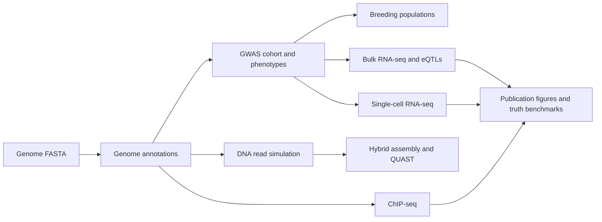
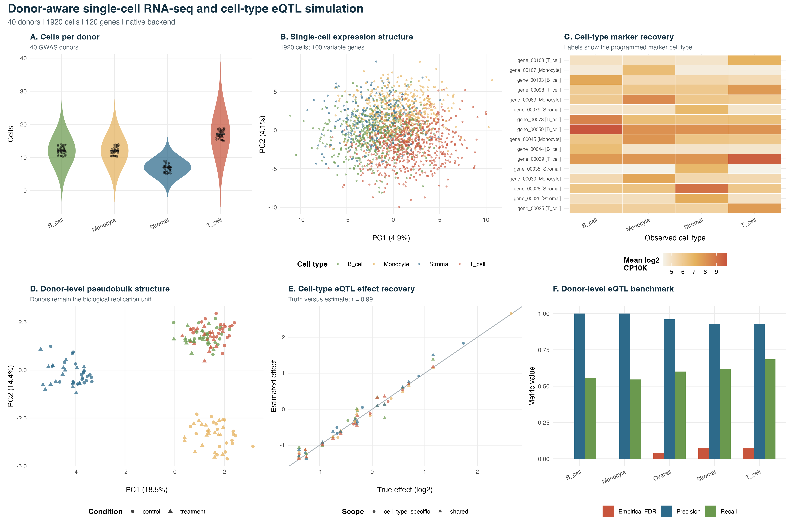
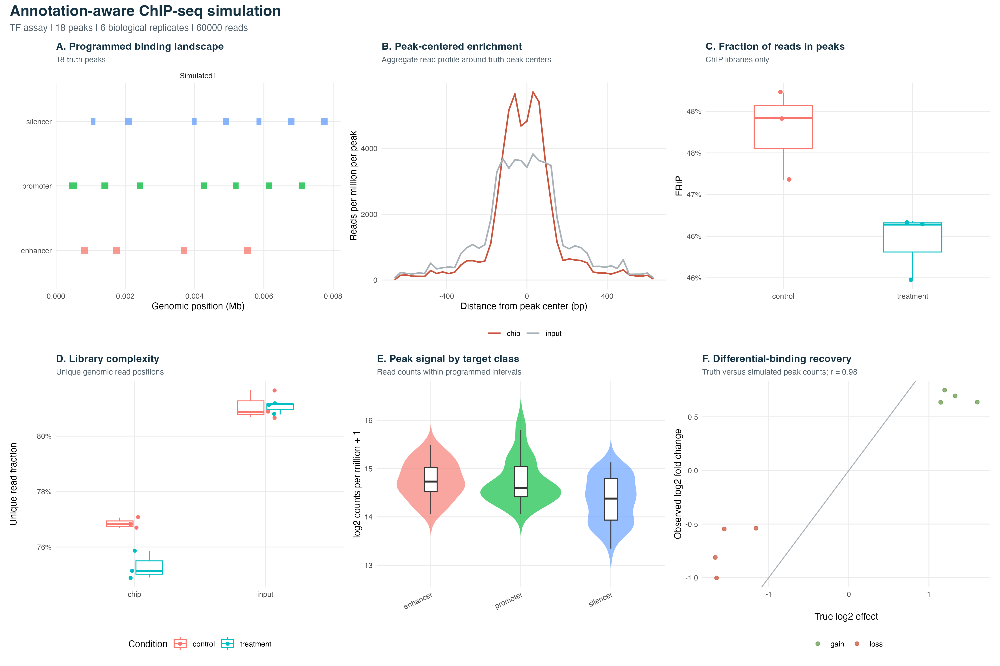

# Detailed Simulation Tutorial

This guide contains the end-to-end `simitall` workflows: genome generation,
annotation, cohorts and traits, breeding, sequencing and assembly, bulk and
single-cell RNA-seq/eQTLs, and ChIP-seq. Install the package first using the
[main README](../README.md#1-install-simitall).

**Navigation:** [Project overview](../README.md) | [Results and validation](VALIDATION.md)

## Workflow map

You do not need to run every branch. Start with a reference or synthetic genome,
annotate it, create related individuals when needed, and then run only the
sequencing or multi-omics modules that address the study question.



## 1. Start a project and simulate a genome

Create one results directory, load the package, and locate the bundled
lightweight example files:

```r
library(simitall)

demo_genome <- system.file(
  "extdata", "examples", "demo_genome.fa",
  package = "simitall"
)
demo_panel <- system.file(
  "extdata", "panels", "demo_panel.fa",
  package = "simitall"
)
```

Generate a synthetic genome with controlled repeats:

```r
dir.create("results", showWarnings = FALSE)

simulate_genome(
  out_fa = "results/synthetic_genome.fa",
  random_genome = TRUE,
  random_length = 100000,
  random_gc = 0.51,
  mode = "both",
  n_events = 10,
  seg_len = 500,
  copies = 3,
  spacing_distribution = "poisson",
  spacing_mean = 5000,
  ploidy = 2,
  snp_rate = 0.001,
  indel_rate = 0.0001,
  seed = 1
)
```

The genome simulator can also modify an existing reference:

```r
simulate_genome(
  in_fa = demo_genome,
  out_fa = "results/reference_with_repeats.fa",
  n_events = 3,
  seg_len = 100,
  copies = 4,
  spacing_distribution = "fixed",
  fixed_spacing = 1000,
  gc_preserve = TRUE
)
```


Key genome controls:

- `random_length` and `random_gc` control synthetic genome size and GC content.
- `in_fa` starts from an existing reference instead of creating random sequence.
- `n_events`, `seg_len`, and `copies` control repeat burden.
- `spacing_distribution` controls uniform, Poisson, or fixed repeat spacing.
- `ploidy`, `snp_rate`, and `indel_rate` control homologous genome copies.

Primary outputs are the simulated FASTA plus repeat-coordinate TSV, BED, GFF3,
per-copy coordinate files, name mappings, and a JSON parameter summary.

## 2. Add genome annotations

Annotations turn the FASTA sequence into a usable genome model for downstream
RNA-seq and ChIP-seq simulation. `simulate_annotations()` can generate genes,
CDS features, operons, TSSs, promoters, terminators, rRNA/tRNA clusters,
riboswitches, CRISPR arrays, plasmids, and regulatory elements.


```r
simulate_annotations(
  in_fa = "results/synthetic_genome.fa",
  out_prefix = "results/synthetic_genome",
  n_genes = 80,
  rrna_clusters = 1,
  trna_per_cluster = 8,
  riboswitch_count = 4,
  crispr_count = 1,
  plasmid_count = 1,
  regulatory_default_human = TRUE,
  seed = 1
)
```


Key annotation controls:

- `n_genes` controls the number of generated gene models.
- `rrna_clusters`, `trna_per_cluster`, and `crispr_count` add bacterial features.
- `riboswitch_count` and regulatory options add functional non-coding elements.
- `plasmid_count` adds plasmid contigs and optional selectable markers.
- `in_gff3` imports existing gene models instead of generating random models.

The GFF3 and feature FASTAs produced here are reused by RNA-seq and ChIP-seq.

## 3. Simulate a GWAS cohort and phenotypes

Use the genome created in Step 2 as the reference for a related cohort:

```r
simulate_gwas_cohort(
  genome_fa = "results/synthetic_genome.fa",
  out_prefix = "results/gwas/demo",
  n_samples = 200,
  snp_rate = 0.01,
  n_pops = 2,
  ld_block_size = 50000,
  phenotype = "quantitative",
  n_causal = 10,
  seed = 1
)
```

Advanced phenotype simulation is optional and requires
`simplePHENOTYPES`:

```r
simulate_phenotypes(
  geno_file = "results/gwas/demo.vcf",
  out_prefix = "results/phenotypes/demo",
  h2 = 0.5,
  n_add_qtn = 20,
  n_traits = 2
)
```

Important GWAS controls are `n_samples`, SNP/indel rates, `n_pops`, `fst`, LD
block size, recombination maps, trait type, causal-locus count, and effect-size
distribution. The cohort writes VCF, genotype, phenotype, population-label,
recombination, and causal-truth files that can feed the later omics sections.

### 3.1 Run and benchmark a GWAS

`analyze_gwas()` uses the mixed model implemented by `rrBLUP::GWAS()`. It can
control relatedness with a genomic relationship matrix and population
structure with fixed effects or marker-derived principal components:

```r
gwas <- analyze_gwas(
  genotype_file = "results/gwas/demo.geno.tsv",
  phenotype = "results/gwas/demo.pheno.tsv",
  out_prefix = "results/gwas/demo_analysis",
  trait = "trait",
  fixed_effects = "pop",
  n_pcs = 2,
  min_maf = 0.05
)

benchmark <- benchmark_gwas(
  gwas_results = gwas$results,
  truth = "results/gwas/demo.causal.tsv",
  out_prefix = "results/gwas/demo_benchmark",
  fdr_threshold = 0.05,
  window_bp = 10000
)

plot_gwas_results(
  benchmark$results,
  out_prefix = "results/figures/demo_gwas"
)
```

The simulator now records `*.causal.tsv` and `true_breeding_value` truth so
association power and genomic-prediction accuracy can be measured directly.

### 3.2 Fit genomic models and select parents

Fit GBLUP or RR-BLUP with `rrBLUP`, Bayesian models with `BGLR`, or random
forest with `ranger`. Candidate samples may have missing phenotypes as long as
their genotypes are present:

```r
fit <- fit_genomic_model(
  genotype_file = "results/gwas/demo.geno.tsv",
  phenotype = "results/gwas/demo.pheno.tsv",
  model = "gblup"
)

predictions <- predict_genomic_values(fit)

cv <- cross_validate_genomic_prediction(
  genotype_file = "results/gwas/demo.geno.tsv",
  phenotype = "results/gwas/demo.pheno.tsv",
  model = "gblup",
  folds = 5,
  true_value = "true_breeding_value"
)
```

Run one complete prediction-selection-cross-planning round:

```r
selection <- run_genomic_selection(
  genotype_file = "results/gwas/demo.geno.tsv",
  phenotype = "results/gwas/demo.pheno.tsv",
  out_prefix = "results/selection/cycle1",
  model = "gblup",
  n_parents = 10,
  n_crosses = 20,
  mating = "minimum_kinship",
  diversity_penalty = 0.25
)
```

The round writes predictions, selected parents, genomic kinship, a crossing
plan, a fitted-model RDS, and a JSON summary. Recombinant offspring generation
from selected diploid parents remains a separate breeding step; the package
does not yet claim an automatic multi-cycle closed loop.

## 4. Simulate breeding populations

Steps 4 and 5 are complementary population-simulation routes. Breeding does
not require the GWAS output: use it when the samples should follow a designed
cross, and use the GWAS cohort simulator for diversity panels or general
population structure.

### 4.1 Choose or generate founders

Every breeding design starts from an aligned multi-FASTA in which each record
is one founder haplotype and all records have the same length. Use the bundled
eight-founder panel for a quick run:

```r
demo_panel <- system.file(
  "extdata", "panels", "demo_panel.fa",
  package = "simitall"
)
stopifnot(nzchar(demo_panel))
```

Alternatively, generate a larger synthetic founder panel:

```r
generate_random_haplotype_panel(
  out_fa = "results/breeding/founders.fa",
  n_haplotypes = 8,
  length = 50000,
  snp_rate = 0.005,
  seed = 1
)
```

The major preset and sequence-based designs are:

| Design | Main setting | Typical use |
|---|---|---|
| F1 | `sequence = "F1"` | Hybrid generation |
| F2 | `scheme = "F2"` | Biparental linkage mapping |
| F2:3-style | `sequence = "F1,SELF:2"` | F3 progeny derived through an F2 generation |
| F2-derived S3 | `sequence = "F1,SELF:4"` | More-inbred F2-derived lines |
| Backcross | `sequence = "F1,BC:P1:3"` | Recurrent-parent recovery |
| RIL | `scheme = "RIL"` | Stable recombinant inbred mapping lines |
| NIL | `scheme = "NIL"` | Donor introgression in a recurrent background |
| DH | `scheme = "DH"` | Immediate homozygous doubled haploids |
| NAM | `scheme = "NAM"` | Families sharing one common parent |
| MAGIC | `scheme = "MAGIC"` | Multi-parent recombination population |

In a custom sequence, `SELF:k`, `SIB:k`, and `BC:P1:k` mean `k` consecutive
generations. `P1` is the recurrent parent and `P2` is the donor unless the
sequence specifies otherwise.

### 4.2 Multi-chromosome breeding

Multi-chromosome founder panels use one FASTA record per founder and
chromosome. Separate the two identifiers with `|`:

```text
>FounderA|chr1
ACGT...
>FounderA|chr2
TGCA...
>FounderB|chr1
ACGA...
>FounderB|chr2
TTCA...
```

Every founder must provide the same chromosome names, and corresponding
chromosomes must have equal aligned lengths. A legacy panel containing one
record per founder remains valid and is interpreted as `chr1`.

Generate a four-founder, three-chromosome example panel:

```r
generate_random_haplotype_panel(
  out_fa = "results/breeding/multichrom_founders.fa",
  n_haplotypes = 4,
  n_chromosomes = 3,
  chromosome_lengths = c(50000, 40000, 30000),
  snp_rate = 0.005,
  indel_rate = 0,
  seed = 2
)
```

A small ready-to-run panel is also bundled with the package:

```r
demo_multi_panel <- system.file(
  "extdata", "panels", "demo_multichrom_panel.fa",
  package = "simitall"
)
```

When `recomb_map_in` is omitted, `simitall` generates an independent random
map for every chromosome. A real or custom map is a tab-separated file with
`chromosome`, `pos_bp`, and `cM` columns:

```r
recombination_map <- data.frame(
  chromosome = rep(c("chr1", "chr2", "chr3"), each = 2),
  pos_bp = c(1, 600, 1, 500, 1, 400),
  cM = c(0, 120, 0, 95, 0, 80)
)
write.table(
  recombination_map,
  "results/breeding/multichrom_map.tsv",
  sep = "\t", quote = FALSE, row.names = FALSE
)

simulate_breeding(
  haplotype_fa = demo_multi_panel,
  out_prefix = "results/breeding/multichrom_f2",
  parents = "hap1,hap2",
  scheme = "F2",
  n_offspring = 100,
  recomb_map_in = "results/breeding/multichrom_map.tsv",
  interference_shape = 2,
  vcf_out = "results/breeding/multichrom_f2.vcf",
  seed = 3
)
```

Each chromosome draws its starting parental homolog independently, providing
Mendelian independent assortment, and then applies crossovers from its own
map. The simulation writes:

- `multichrom_f2.fa`: both haplotypes of every chromosome.
- `multichrom_f2.vcf`: chromosome-aware variants and contig headers.
- `multichrom_f2.ancestry.tsv`: founder ancestry tracts.
- `multichrom_f2.breakpoints.tsv`: ancestry junctions and flanking founders.
- `multichrom_f2.recombination_map.tsv`: the maps actually used.
- `multichrom_f2.sv_truth.tsv`: inherited structural-variant truth when
  `sv_rate > 0`.
- `multichrom_f2.meta.tsv`: sample, generation, scheme, and family labels.

Locus arguments are chromosome-aware. For example, use
`fix_locus = "chr2:10000:12000"` and
`selection_loci = "chr1:5000,chr3:15000"`. Legacy coordinates such as
`fix_locus = "800:900"` continue to target the first chromosome.

### 4.3 F1, F2, and advanced selfing populations

Generate 100 F1 individuals from `hap1` and `hap2`:

```r
simulate_breeding(
  haplotype_fa = demo_panel,
  out_prefix = "results/breeding/f1",
  parents = "hap1,hap2",
  sequence = "F1",
  n_offspring = 100,
  vcf_out = "results/breeding/f1.vcf",
  seed = 11
)
```

Generate a conventional F2 mapping population:

```r
simulate_breeding(
  haplotype_fa = demo_panel,
  out_prefix = "results/breeding/f2",
  parents = "hap1,hap2",
  scheme = "F2",
  n_offspring = 250,
  vcf_out = "results/breeding/f2.vcf",
  graph_out = "results/breeding/f2_cross.mmd",
  seed = 12
)
```

Custom selfing sequences make later-generation populations. The first example
passes through F1, F2, and F3 and is useful as an F2:3-style final generation.
The second adds three selfing cycles after F2, producing F2-derived S3 lines:

```r
simulate_breeding(
  haplotype_fa = demo_panel,
  out_prefix = "results/breeding/f2_3",
  parents = "hap1,hap2",
  sequence = "F1,SELF:2",
  n_offspring = 200,
  vcf_out = "results/breeding/f2_3.vcf",
  seed = 13
)

simulate_breeding(
  haplotype_fa = demo_panel,
  out_prefix = "results/breeding/f2_s3",
  parents = "hap1,hap2",
  sequence = "F1,SELF:4",
  n_offspring = 200,
  vcf_out = "results/breeding/f2_s3.vcf",
  seed = 14
)
```

These sequence-based examples return the final generation. They model the
genetic progression through F2 and F3 but do not currently retain every
intermediate plant as a separately exported F2:3 pedigree family.

### 4.4 RIL and doubled-haploid populations

Create recombinant inbred lines by single-seed descent. Increasing
`self_generations` reduces residual heterozygosity, while
`interference_shape > 1` creates more regularly spaced crossovers than a
Poisson model:

```r
simulate_breeding(
  haplotype_fa = demo_panel,
  out_prefix = "results/breeding/ril_ssd",
  parents = "hap1,hap2",
  scheme = "RIL",
  ril_mating = "SSD",
  self_generations = 8,
  n_offspring = 200,
  interference_shape = 2,
  genotype_error = 0.005,
  missing_rate = 0.01,
  vcf_out = "results/breeding/ril_ssd.vcf",
  seed = 21
)
```

Use sibling mating instead of SSD when that better matches the organism or
breeding program:

```r
simulate_breeding(
  haplotype_fa = demo_panel,
  out_prefix = "results/breeding/ril_sib",
  parents = "hap1,hap2",
  scheme = "RIL",
  ril_mating = "SIB",
  self_generations = 8,
  n_offspring = 200,
  vcf_out = "results/breeding/ril_sib.vcf",
  seed = 22
)
```

Doubled haploids receive one recombinant gamete and duplicate it, so the final
lines should have essentially no biological heterozygosity:

```r
simulate_breeding(
  haplotype_fa = demo_panel,
  out_prefix = "results/breeding/dh",
  parents = "hap1,hap2",
  scheme = "DH",
  n_offspring = 200,
  vcf_out = "results/breeding/dh.vcf",
  seed = 23
)
```

### 4.5 Backcross and NIL populations

The sequence API can combine backcrossing and selfing. This example makes an
F1, performs three backcrosses to `P1`, and then self-fertilizes twice:

```r
simulate_breeding(
  haplotype_fa = demo_panel,
  out_prefix = "results/breeding/bc3s2",
  parents = "hap1,hap2",
  sequence = "F1,BC:P1:3,SELF:2",
  n_offspring = 150,
  vcf_out = "results/breeding/bc3s2.vcf",
  seed = 31
)
```

For NILs, foreground selection can force a donor interval to remain while
background selection chooses candidates with less donor ancestry elsewhere.
The coordinates below fit the bundled 2 kb demo panel; use biologically
meaningful coordinates for a real chromosome:

```r
simulate_breeding(
  haplotype_fa = demo_panel,
  out_prefix = "results/breeding/nil_target",
  parents = "hap1,hap2",
  scheme = "NIL",
  n_offspring = 100,
  backcross_generations = 4,
  self_generations = 3,
  fix_locus = "800:900",
  fix_allele = "donor",
  background_selection = TRUE,
  selection_pool = 50,
  marker_step = 50,
  introgression_target_len = 300,
  vcf_out = "results/breeding/nil_target.vcf",
  seed = 32
)
```

### 4.6 NAM and MAGIC populations

A NAM population uses the first selected founder as the common parent and
crosses it to each remaining founder. Family IDs are retained in the metadata
and VCF sample declarations:

```r
simulate_breeding(
  haplotype_fa = demo_panel,
  out_prefix = "results/breeding/nam",
  scheme = "NAM",
  founders = "hap1,hap2,hap3,hap4,hap5",
  n_offspring = 400,
  vcf_out = "results/breeding/nam.vcf",
  graph_out = "results/breeding/nam_cross.mmd",
  seed = 41
)
```

MAGIC combines multiple founders before repeated selfing. This example uses
all eight demo founders and six selfing generations:

```r
simulate_breeding(
  haplotype_fa = demo_panel,
  out_prefix = "results/breeding/magic8",
  scheme = "MAGIC",
  founders = paste0("hap", 1:8, collapse = ","),
  n_offspring = 300,
  self_generations = 6,
  interference_shape = 2,
  vcf_out = "results/breeding/magic8.vcf",
  graph_out = "results/breeding/magic8_cross.mmd",
  seed = 42
)
```

### 4.7 Forward-time mating with SimuPOP

`simulate_breeding()` follows explicit founder haplotypes and designed crosses.
Use `simupop_api()` when the experiment instead needs forward-time population
evolution, flexible population sizes, parent-choice rules, pedigrees, mixed
mating systems, or custom Python hooks.

Initialize a SimuPOP F2 preset from variable sites in the demo panel:

```r
simupop_api(
  out_prefix = "results/simupop/f2",
  config = list(
    population = list(size = 200, ploidy = 2, infoFields = "ind_id"),
    init = list(
      from_fasta = demo_panel,
      max_loci = 500,
      sample_haplotypes = TRUE
    ),
    preset = "F2",
    export_vcf = TRUE,
    generations = 2
  )
)
```

Run ten generations of random mating without a preset:

```r
simupop_api(
  out_prefix = "results/simupop/random10",
  config = list(
    population = list(size = 500, ploidy = 2, loci = 1000),
    mating = list(
      scheme = "RandomMating",
      offspring = 500,
      numOffspring = 1
    ),
    generations = 10,
    export_vcf = TRUE
  )
)
```

`simupop_api()` also supports random, monogamous, polygamous, selfing,
hermaphroditic, clonal, conditional, heterogeneous, pedigree, and controlled
mating schemes. A `python_hook` field can define specialized SimuPOP parent
choosers or allele-frequency trajectories before a run.

### 4.8 Breeding outputs and important controls

Each `simulate_breeding()` run writes diploid haplotypes to `.fa` and sample,
generation, scheme, and family labels to `.meta.tsv`. Set `vcf_out` for marker
genotypes and `graph_out` for a Mermaid crossing graph. SVG or PNG rendering
can be requested with `graph_format` when Mermaid CLI (`mmdc`) is installed.

Important controls include `parents`, `founders`, `n_offspring`,
`self_generations`, `backcross_generations`, `ril_mating`, recombination-map
settings, crossover interference, locus fixation, background selection,
segregation distortion, genotype error, missingness, marker ascertainment, and
structural-variant rate.

### 4.9 Ordinal, count, family, and maternal phenotypes

The population installation profile includes two established phenotype
backends:

- `simstudy` generates ordinal outcomes, Poisson or negative-binomial counts,
  and shared family-level random effects.
- `pedtricks` generates direct, maternal, and paternal genetic or
  environmental effects across arbitrary pedigrees.

`simitall` validates and connects the data but does not replace either
package's statistical simulator.

First generate a genotype-driven quantitative score for the F2 population:

```r
simulate_phenotypes(
  geno_file = "results/breeding/f2.vcf",
  out_prefix = "results/breeding/f2_base_trait",
  h2 = 0.5,
  n_add_qtn = 20,
  seed = 51
)

metadata <- read.delim("results/breeding/f2.meta.tsv")
base_trait <- read.delim("results/breeding/f2_base_trait.pheno.tsv")

# The first column is the sample ID and the first numeric trait is the score.
names(base_trait)[1] <- "sample"
trait_column <- names(base_trait)[
  vapply(base_trait, is.numeric, logical(1))
][1]
base_trait$genetic_score <- base_trait[[trait_column]]
records <- merge(
  metadata,
  base_trait[c("sample", "genetic_score")],
  by = "sample",
  sort = FALSE
)
```

Add one `simstudy` random effect per breeding family. Every member of the same
family receives the same generated effect:

```r
records <- simulate_family_effects(
  data = records,
  family_id = "family",
  variance = 0.2,
  effect_name = "family_effect",
  out_file = "results/breeding/f2.family_effects.tsv",
  seed = 52
)

records$liability <- records$genetic_score + records$family_effect
```

Convert that liability into ordered disease or resistance categories:

```r
ordinal <- simulate_ordinal_trait(
  data = records,
  predictor = "liability",
  probabilities = c(0.10, 0.30, 0.40, 0.20),
  labels = c("resistant", "mild", "moderate", "severe"),
  trait_name = "disease_severity",
  out_file = "results/breeding/f2.ordinal.tsv",
  seed = 53
)
```

Generate an overdispersed count such as lesion number, seed count, or
infection burden. The formula is interpreted by `simstudy` on the selected
link scale:

```r
counts <- simulate_count_trait(
  data = records,
  formula = "1 + 0.4 * genetic_score + family_effect",
  distribution = "negative_binomial",
  dispersion = 0.6,
  link = "log",
  trait_name = "lesion_count",
  out_file = "results/breeding/f2.count.tsv",
  seed = 54
)
```

Use `distribution = "poisson"` when conditional variance is expected to be
close to the conditional mean. Use `"negative_binomial"` when biological
counts are overdispersed.

Maternal and paternal effects require an explicit pedigree. The pedigree may
come from an external breeding record or another simulator and must include
every referenced parent:

```r
pedigree <- data.frame(
  id = c("dam1", "sire1", "child1", "child2"),
  sire = c(NA, NA, "sire1", "sire1"),
  dam = c(NA, NA, "dam1", "dam1")
)

parental <- simulate_parental_effects(
  pedigree = pedigree,
  traits = 1,
  genetic_covariance = diag(c(1.0, 0.30)),
  environmental_covariance = diag(c(0.8, 0.20)),
  parental_genetic = c("d", "m"),
  parental_environmental = c("d", "m"),
  out_prefix = "results/breeding/maternal_trait",
  seed = 55
)
```

The `pedtricks` effect codes are `"d"` for direct, `"m"` for maternal, and
`"p"` for paternal. The example writes:

- `maternal_trait.phenotypes.tsv`: final simulated phenotype.
- `maternal_trait.effects.tsv`: direct and maternal genetic/environmental
  truth components.
- `maternal_trait.summary.json`: backend version and simulation settings.

For multiple traits, provide covariance matrices whose dimensions match the
effect-code vectors. For example, two direct traits plus two maternal traits
use four-by-four covariance matrices and
`parental_genetic = c("d", "d", "m", "m")`.

## 5. Simulate DNA sequencing and assembly

All external programs are called from R:

```r
sim_illumina_art(
  ref_fa = "results/synthetic_genome.fa",
  outprefix = "results/reads/illumina_",
  cov = 30
)

sim_pacbio(
  ref_fa = "results/synthetic_genome.fa",
  outdir = "results/reads/pacbio_hifi",
  cov = 20,
  type = "HIFI"
)

sim_nanopore(
  ref_fa = "results/synthetic_genome.fa",
  outdir = "results/reads/nanopore",
  cov = 20
)
```

Run a small coverage grid, hybrid assemblies, and QUAST:

```r
run_grid_both(
  simref_fa = "results/synthetic_genome.fa",
  tag = "demo",
  ill_covs = c(20, 40),
  pb_covs = c(10, 20),
  output_dir = "results/reads"
)

run_unicycler_grid(
  tag = "demo",
  reads_dir = "results/reads",
  output_dir = "results/assemblies",
  ill_covs = c(20, 40),
  pb_covs = c(10, 20)
)

run_quast_grid(
  tag = "demo",
  ref_fa = "results/synthetic_genome.fa",
  assemblies_dir = "results/assemblies",
  output_dir = "results/evaluation",
  ill_covs = c(20, 40),
  pb_covs = c(10, 20)
)

summarize_quast(
  quast_root = "results/evaluation/demo",
  out_csv = "results/quast_summary.csv"
)
```


Coverage, read length, insert/fragment length, long-read technology, and the
Illumina-by-long-read grid are the main controls. These steps require the
external ART, PBSIM/PBSIM3, Badread, Unicycler, and QUAST programs installed in
the supplied Conda environment.

## 6. Simulate bulk RNA-seq and eQTLs

Bulk RNA-seq can be simulated independently or from exactly the same genotype
samples produced in Step 4. Use the standalone path for differential-expression
benchmarks, or the GWAS-linked path when cis/trans eQTLs, genotype-by-condition
interactions, and allele-specific expression are required.

### 6.1 Standalone bulk RNA-seq

Genotypes are optional. `simulate_rnaseq_experiment()` creates a conventional
bulk RNA-seq experiment directly from sample names or an experiment design.
This is useful for differential-expression methods, batch-correction tests,
power studies, and repeated sequencing of one sample.

The replicate modes have deliberately different meanings:

- `replicate_mode = "technical"`: one biological sample with independently
  generated sequencing libraries
- `replicate_mode = "biological"`: independent biological samples with one
  library each
- `replicate_mode = "mixed"`: independent biological samples, each measured
  by multiple technical libraries

For example, simulate three technical libraries from the same biological
sample:

```r
bulk_technical <- simulate_rnaseq_experiment(
  out_prefix = "results/rnaseq/sample_A",
  sample_names = "sample_A",
  replicates = 3,
  replicate_mode = "technical",
  n_genes = 1000,
  seed = 1
)
```

To simulate three biological replicates in each of two conditions:

```r
bulk_biological <- simulate_rnaseq_experiment(
  out_prefix = "results/rnaseq/control_vs_drought",
  sample_names = c("control", "drought"),
  conditions = c("control", "drought"),
  replicates = 3,
  replicate_mode = "biological",
  n_genes = 1000,
  seed = 2
)
```

An aggregated design gives full control over biological and technical
replication. Each row describes one sample or experimental group:

```r
design <- data.frame(
  sample = c("control", "drought"),
  condition = c("control", "drought"),
  batch = c("batch1", "batch2"),
  biological_replicates = c(3, 3),
  technical_replicates = c(2, 2)
)

bulk_mixed <- simulate_rnaseq_experiment(
  out_prefix = "results/rnaseq/mixed_design",
  design = design,
  n_genes = 1000,
  seed = 3
)
```

### 6.2 Bulk RNA-seq from the GWAS cohort

`simulate_rnaseq_from_gwas()` uses the GWAS genotype matrix as its starting
point, so the RNA-seq sample IDs and genotypes are the same individuals used in
the association cohort. Its gene-by-sample expression model is:

```text
log2 abundance = baseline
               + cis-eQTL genotype effect
               + trans-eQTL genotype effects
               + condition effect
               + genotype-by-condition interaction
               + batch effect
               + latent confounders
               + residual noise
```

Expected abundances are converted to sample-specific library sizes and sampled
with gene-specific negative-binomial dispersion. This separates biological
causal truth from count sampling noise while retaining both in the output.

```r
rna <- simulate_rnaseq_from_gwas(
  genotype_file = "results/gwas/demo.geno.tsv",
  out_prefix = "results/rnaseq/demo",
  annotation_gff3 = "results/synthetic_genome.gff3",
  n_cis_eqtl = 200,
  n_trans_eqtl = 50,
  cis_window_bp = 1e6,
  condition_levels = c("control", "drought"),
  batch_levels = c("batch1", "batch2"),
  condition_effect_fraction = 0.10,
  gxe_fraction = 0.20,
  ase_fraction = 0.25,
  n_latent = 3,
  seed = 1
)
```

If no GFF3 is supplied, synthetic genes are distributed across the simulated
variant coordinates. A user-provided sample metadata TSV can assign conditions,
batches, populations, families, or other labels; it must contain a `sample`
column matching the genotype samples.

Key outputs are:

- `*.counts.tsv`: negative-binomial gene counts
- `*.expression.tsv`: log2 counts per million for association testing
- `*.expected_counts.tsv`: expected counts before count sampling
- `*.sample_metadata.tsv`: GWAS sample IDs, conditions, batches, and libraries
- `*.gene_metadata.tsv`: coordinates, baselines, and dispersions
- `*.eqtl_truth.tsv`: causal cis/trans and genotype-by-condition effects
- `*.condition_truth.tsv` and `*.batch_truth.tsv`: known experimental effects
- `*.latent_scores.tsv` and `*.latent_loadings.tsv`: hidden-factor truth
- `*.ase_truth.tsv` and `*.ase_counts.tsv`: allele-specific expression truth
- `*.summary.json`: parameters and generated feature counts

Benchmark eQTL recovery against the known causal pairs:

```r
eqtl <- benchmark_eqtl(
  genotype_file = "results/gwas/demo.geno.tsv",
  expression_file = rna$expression,
  out_prefix = "results/eqtl/demo",
  sample_metadata = rna$sample_metadata,
  truth_file = rna$eqtl_truth,
  pair_mode = "truth_neighborhood",
  cis_window_bp = 1e6,
  covariates = c("condition", "batch"),
  test_gxe = TRUE
)
```

The benchmark writes association statistics, BH-adjusted p-values, causal-pair
labels, and precision, recall, and empirical FDR summaries. `pair_mode = "cis"`
tests all local variant-gene pairs when gene metadata is supplied, while
`pair_mode = "all"` is available for deliberately small datasets.

### 6.3 Optional RNA-seq FASTQ files

The count simulator is the causal experimental engine. When sequence-level
reads are needed, `simulate_rnaseq_reads()` passes its expression levels to
`Rsubread::simReads()` and writes one single- or paired-end FASTQ library per
GWAS individual:

```r
simulate_rnaseq_reads(
  expression = rna$counts,
  transcript_fasta = "results/synthetic_genome.genes.fa",
  out_dir = "results/rnaseq/fastq",
  library_size = 100000,
  read_length = 100,
  paired_end = TRUE,
  seed = 1
)
```

Transcript FASTA IDs must match the expression gene IDs. For isoforms, pass a
two-column `transcript_gene_map` containing `transcript_id` and `gene_id`; gene
abundance is then divided among mapped transcripts. FASTQ simulation can also
be requested directly with `simulate_rnaseq_from_gwas(simulate_reads = TRUE,
transcript_fasta = ...)`.

### 6.4 eQTL benchmarks and publication figures

Summarize the count simulation and eQTL benchmark in one result row:

```r
summarize_rnaseq_results(
  rnaseq_prefix = "results/rnaseq/demo",
  eqtl_prefix = "results/eqtl/demo",
  out_tsv = "results/figures/rnaseq_summary.tsv"
)
```

Generate a six-panel PDF and PNG containing library-size distributions,
expression PCA, the eQTL association landscape, causal-effect recovery, ASE
recovery, and precision/recall/FDR metrics:

```r
plot_rnaseq_eqtl_results(
  rnaseq_prefix = "results/rnaseq/demo",
  eqtl_prefix = "results/eqtl/demo",
  out_prefix = "results/figures/rnaseq_eqtl"
)
```

Each panel's source data are written as separate CSV files beside the figure.
The repository also includes a complete reproducible runner that starts from
the bundled genome and produces the cohort, RNA-seq data, benchmark, figure,
summary, and panel source tables:

```bash
Rscript analysis/paper_fig/fig6_rnaseq_eqtl_simulation.R
```

See `analysis/paper_fig/README.md` for runner options and paper-scale guidance.

## 7. Simulate single-cell RNA-seq

Single-cell experiments can also be standalone or linked to the GWAS cohort.
In either case, cells are technical observations nested within biological
samples or donors; donor-level pseudobulk is provided for valid inference.

### 7.1 Standalone single-cell experiments

The same design model is available for single-cell experiments. Here, three
technical capture libraries are generated from the same biological sample:

```r
sc_technical <- simulate_scrnaseq_experiment(
  out_prefix = "results/scrna/sample_A",
  sample_names = "sample_A",
  replicates = 3,
  replicate_mode = "technical",
  cells_per_replicate = 500,
  n_genes = 1000,
  cell_type_proportions = c(
    T_cell = 0.4,
    B_cell = 0.3,
    Monocyte = 0.3
  ),
  backend = "auto",
  seed = 4
)

plot_scrnaseq_results(
  scrna_prefix = "results/scrna/sample_A",
  out_prefix = "results/figures/sample_A_scrna"
)
```

Standalone single-cell output includes donor-level pseudobulk, which combines
technical captures before biological interpretation, and library-level
pseudobulk, which keeps captures separate for technical-QC analyses. Technical
replicates increase measurement precision but are not independent biological
replicates and should not be counted as separate donors in inference.

### 7.2 Single-cell RNA-seq from GWAS donors

`simulate_scrnaseq_from_gwas()` expands each GWAS individual into a donor with
many cells while keeping the original genotype, population, family, phenotype,
condition, and batch information. Its biological model is:

```text
single-cell log2 abundance = technical gene/cell scaffold
                           + cell-type marker program
                           + shared or cell-type-specific eQTL effect
                           + condition and genotype-by-condition effects
                           + donor effect
                           + pseudotime effect
                           + batch and latent effects
                           + residual cell noise
```

Expected abundance is converted into UMI libraries and sampled with
gene-specific negative-binomial dispersion. Optional expression-dependent
dropout, ambient RNA, and doublet profiles are applied while their parameters
and labels are retained as simulation truth.

```r
sc <- simulate_scrnaseq_from_gwas(
  genotype_file = "results/gwas/demo.geno.tsv",
  out_prefix = "results/scrna/demo",
  sample_metadata = "results/gwas/demo.pheno.tsv",
  annotation_gff3 = "results/synthetic_genome.gff3",
  n_genes = 1000,
  cells_per_donor = 100,
  cell_type_proportions = c(
    T_cell = 0.35,
    B_cell = 0.25,
    Monocyte = 0.25,
    Stromal = 0.15
  ),
  trajectory_cell_types = c("T_cell", "Monocyte"),
  n_cis_eqtl = 200,
  n_trans_eqtl = 50,
  cell_type_eqtl_fraction = 0.50,
  condition_levels = c("control", "drought"),
  gxe_fraction = 0.20,
  dropout_rate = 0.05,
  doublet_rate = 0.03,
  ambient_fraction = 0.02,
  backend = "auto",
  seed = 1
)
```

The simulator writes:

- `*.matrix.mtx`, `*.features.tsv`, and `*.barcodes.tsv`: sparse 10x-style data
- `*.scrnaseq.rds`: portable `simitall_scrnaseq` counts and metadata object
- `*.sce.rds`: optional `SingleCellExperiment` object
- `*.cell_metadata.tsv`: donor, cell type, condition, batch, pseudotime,
  library, detected-gene, and doublet labels
- `*.celltype_eqtl_truth.tsv`: shared and cell-type-specific causal pairs
- `*.marker_truth.tsv`: programmed cell-type marker genes
- `*.condition_truth.tsv`, `*.batch_truth.tsv`, and
  `*.pseudotime_truth.tsv`: known biological and technical effects
- `*.pseudobulk.counts.tsv` and `*.pseudobulk.expression.tsv`: donor-by-cell-type
  libraries
- `*.summary.json`: parameters, backend, dimensions, and truth counts

Existing bulk or user-defined eQTL truth can be assigned shared and
cell-type-specific activity independently of count simulation:

```r
cell_truth <- simulate_celltype_eqtls(
  eqtl_truth = "results/rnaseq/demo.eqtl_truth.tsv",
  cell_types = c("T_cell", "B_cell", "Monocyte", "Stromal"),
  cell_type_specific_fraction = 0.5,
  out_tsv = "results/scrna/custom_celltype_eqtl_truth.tsv",
  seed = 1
)
```

Pseudobulk is generated automatically and can also be rebuilt with alternative
metadata groups:

```r
aggregate_scrnaseq_pseudobulk(
  counts = "results/scrna/demo",
  out_prefix = "results/scrna/demo_by_condition",
  group_by = c("donor", "cell_type", "condition"),
  min_cells = 10
)
```

Cell-type eQTL testing uses one pseudobulk library per donor and cell type.
This is important: cells from one donor are technical observations, not
independent biological replicates.

```r
celltype_eqtl <- benchmark_celltype_eqtls(
  genotype_file = "results/gwas/demo.geno.tsv",
  pseudobulk_expression = sc$pseudobulk_expression,
  pseudobulk_metadata = sc$pseudobulk_metadata,
  truth_file = sc$eqtl_truth,
  out_prefix = "results/scrna/demo_celltype_eqtl",
  covariates = c("condition", "batch", "pop"),
  min_donors = 20
)
```

Generate the six-panel result figure and panel-level source data:

```r
plot_scrnaseq_results(
  scrna_prefix = "results/scrna/demo",
  eqtl_prefix = "results/scrna/demo_celltype_eqtl",
  out_prefix = "results/figures/scrna_celltype_eqtl"
)
```



The complete lightweight example is reproducible from the repository root:

```bash
Rscript analysis/paper_fig/fig7_scrnaseq_celltype_eqtl.R \
  --backend native
```

The native backend keeps the workflow dependency-light. Splatter supplies a
gamma-Poisson single-cell scaffold when installed; `simitall` then overlays the
GWAS donor genotypes and explicit biological truth. This separation makes it
possible to add reference-fitted or multi-omic backends later without changing
the donor/eQTL API.

## 8. Simulate ChIP-seq

`simulate_chipseq()` connects the existing promoter, enhancer, silencer, gene,
and regulatory annotations to transcription-factor, histone-mark, or
nucleosome ChIP-seq experiments. Candidate intervals can come from GFF3, a
user BED file, or random genomic positions when no annotation is supplied.

```r
chip <- simulate_chipseq(
  genome_fa = "results/synthetic_genome.fa",
  annotation_gff3 = "results/synthetic_genome.gff3",
  out_prefix = "results/chipseq/tf_demo",
  assay_type = "TF",
  target_features = c("promoter", "enhancer", "silencer"),
  n_peaks = 100,
  conditions = c("control", "treatment"),
  biological_replicates = 3,
  technical_replicates = 1,
  differential_binding_fraction = 0.2,
  signal_fraction = 0.35,
  n_reads = 100000,
  input_reads = 100000,
  backend = "auto",
  seed = 1
)
```

Histone-mark presets choose suitable target classes, widths, and broad-peak
behavior. Available presets are `H3K4me3`, `H3K27ac`, `H3K27me3`, and
`H3K36me3`:

```r
simulate_chipseq(
  genome_fa = "results/synthetic_genome.fa",
  annotation_gff3 = "results/synthetic_genome.gff3",
  out_prefix = "results/chipseq/h3k27ac",
  assay_type = "histone",
  histone_mark = "H3K27ac",
  conditions = c("control", "treatment"),
  biological_replicates = 3,
  seed = 2
)
```

`backend = "auto"` uses ChIPsim's strand-specific binding/read-density model
for small references when available. Large references automatically use the
native interval sampler to avoid allocating chromosome-length dense vectors.
Both backends produce the same interoperable truth, QC, peak-count, read-
position, metadata, and FASTQ interfaces.

Generate a six-panel PDF and PNG with genomic peak locations, aggregate
peak-centered enrichment, FRiP, library complexity, signal by annotation
class, and differential-binding recovery:

```r
plot_chipseq_results(
  chip_prefix = "results/chipseq/tf_demo",
  out_prefix = "results/figures/tf_chipseq"
)
```



The complete lightweight example and all panel source-data tables are
reproducible with:

```bash
Rscript analysis/paper_fig/fig8_chipseq_simulation.R --backend native
```

Key outputs include `*.truth_peaks.bed`, `*.truth_peaks.tsv`, matched ChIP and
input FASTQs, `*.peak_counts.tsv`, `*.qc.tsv`, differential-binding truth,
sample metadata, read positions, and a JSON parameter summary.

## 9. Example data

Small synthetic files are bundled under `inst/extdata`:

- `examples/demo_genome.fa`: tiny genome for smoke tests
- `panels/demo_panel.fa`: aligned synthetic founder haplotypes
- `markers/markers_curated.tsv`: antibiotic-marker accession manifest
- `regulatory/regulatory_panel_human.tsv`: synthetic human-inspired
  enhancer/silencer placement panel
- `config/simupop_example.json`: example SimuPOP configuration

Download larger references only when needed:

```r
fetch_ref_files("references")
fetch_marker_panel("references/antibiotic_markers.fa")
```

`fetch_ref_files()` retrieves E. coli K-12 MG1655, human GRCh38 chromosome 1,
maize B73 chromosome 1, and Arabidopsis chromosome 1 from NCBI. Users can pass
their own FASTA, GFF3, recombination maps, regulatory panels, marker panels,
and aligned founder haplotypes to the corresponding simulators.
