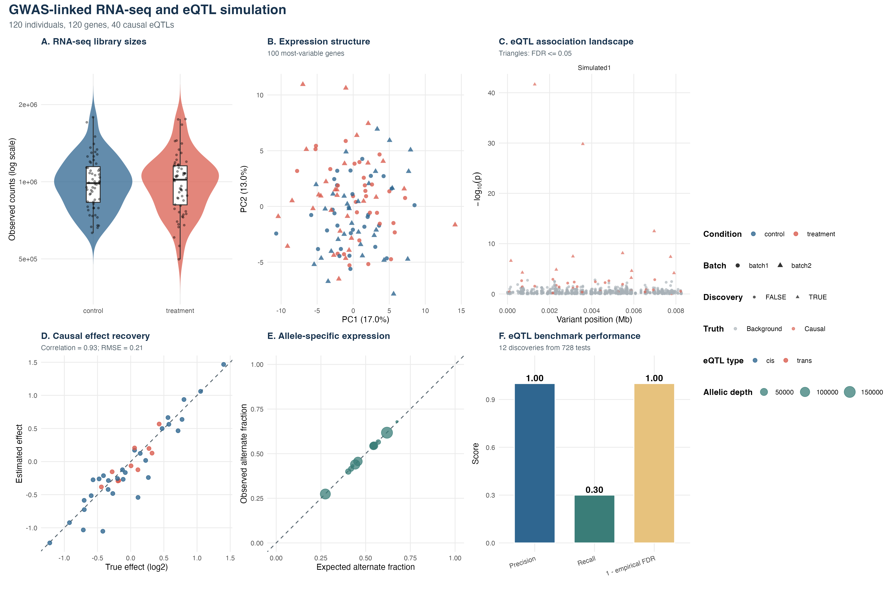
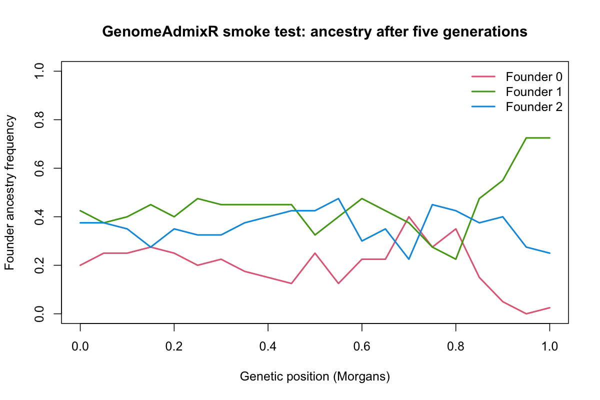

# simitall Results and Validation

This page collects reproducible demonstration results for `simitall`. Each
example starts from explicitly simulated truth, runs a public package workflow,
and writes both a figure and the tables used to construct it. These are
**implementation and recovery checks**, not evidence that a small synthetic
example reproduces the full biology, sequencing bias, population history, or
experimental complexity of a real organism.

The complete test suite is the primary regression check. The figures below are
human-readable companion demonstrations that show the data products and known
truth used by selected workflows.

## Validation principles

- **Known truth first:** simulations retain causal variants, ancestry, feature
  intervals, conditions, batch labels, and other generative parameters.
- **Separate generation from evaluation:** an analysis result is compared with
  its corresponding truth table rather than judged only by a visual pattern.
- **Reproducible examples:** every figure has a public R script, a fixed seed,
  and source-data tables in `analysis/results/` after it is generated.
- **Appropriate claims:** passing a smoke test verifies interface and output
  behavior for that configuration. It does not validate scientific realism for
  a species or establish performance on external data.

## Example figures

### GWAS-linked bulk RNA-seq and eQTL recovery



This fixed-seed demonstration simulates a structured 120-individual GWAS
cohort, then derives a 120-gene bulk RNA-seq experiment from those same donor
genotypes. The benchmark tests 728 eQTL associations and reports 12 discoveries
at the configured threshold; all 12 are true positives, yielding precision 1.00
and recall 0.30 in this intentionally small example. The figure displays
library-size and expression structure, estimated versus true effects, and
recovery metrics.

Reproduce it:

```bash
Rscript analysis/paper_fig/fig6_rnaseq_eqtl_simulation.R \
  --out_dir analysis/results/rnaseq_eqtl_smoke --seed 42
```

Outputs include the count and expression matrices, sample metadata, eQTL truth,
association results, benchmark metrics, the figure summary, and panel-level
source-data tables in `analysis/results/rnaseq_eqtl_smoke/`.

### Donor-aware single-cell RNA-seq and cell-type eQTLs


This example creates 1,920 cells from 40 simulated GWAS donors across four cell
types, then aggregates donor-by-cell-type pseudobulk libraries for eQTL testing.
The overall benchmark contains 3,192 tests, 80 truth pairs in the tested set,
and 50 discoveries: 48 true positives and 2 false positives (precision 0.96,
recall 0.60). It demonstrates why cells from the same donor are not treated as
independent biological replicates.

Reproduce it:

```bash
Rscript analysis/paper_fig/fig7_scrnaseq_celltype_eqtl.R \
  --out_dir analysis/results/scrnaseq_celltype_eqtl --seed 52 --backend native
```

### Annotation-aware ChIP-seq


The ChIP-seq demonstration writes promoter, enhancer, and silencer annotations
on the bundled toy genome, simulates matched ChIP and input libraries for two
conditions with three biological replicates each, and evaluates known peak
locations and differential binding. The saved run contains 18 simulated peaks,
six ChIP libraries, 60,000 total reads, mean ChIP FRiP 0.471, and mean unique
fraction 0.786. Its panels summarize peak landscape, peak-centered enrichment,
FRiP, library complexity, feature-specific signal, and differential binding.

Reproduce it:

```bash
Rscript analysis/paper_fig/fig8_chipseq_simulation.R \
  --out_dir analysis/results/chipseq_example --seed 62 --backend native
```

### Ancestry-tract smoke test



This minimal example verifies the `GenomeAdmixR` integration used for synthetic
ancestry truth. It simulates one chromosome with three founders, 21 markers, 20
diploid individuals, and five generations of random mating. The plotted final
ancestry frequencies are an output of that fixed-seed run; they are not a
local-ancestry inference result and do not constitute an ancestry-aware GWAS.

Reproduce it:

```bash
Rscript inst/extdata/examples/ancestry_tract_smoke.R \
  results/ancestry_tract_smoke
```

The runner writes initial and final ancestry frequencies, an ancestry-frequency
summary, metadata, and the PNG. It requires `GenomeAdmixR`.

## Other validation boundaries

| Area | Truth retained | Recommended check | Current example boundary |
| --- | --- | --- | --- |
| Genome and annotation simulation | Insertions, features, coordinates, and parameters | Coordinate, FASTA/GFF3/BED/TSV consistency and seed reproducibility | Validate with package tests and user-selected reference or synthetic genomes. |
| Breeding and designed crosses | Parentage, families, tracts, breakpoints, and maps | Segregation, heterozygosity, breakpoint, and LD summaries | Validate per species with real maps and founder panels before biological interpretation. |
| GWAS and genomic selection | Genotypes, causal loci, effects, phenotype architecture, and family labels | Causal recovery, calibration, family-aware holdout, prediction accuracy, diversity | Results depend on the chosen trait architecture and training design. |
| Hybrid assembly | Simulated reference, reads, and assembler output | QUAST against the matching truth reference | Requires ART/PBSIM/Badread, an assembler, and QUAST; empirical output is run-dependent. |
| Ancestry-aware GWAS | Simulated ancestry tracts, founder labels, and maps | Compare a method's inferred ancestry and association results with retained truth | This package documents integration boundaries; real-data local ancestry requires external inference tools and validation. |

## Regenerate all figure demonstrations

From the repository root, run the individual scripts above. They deliberately
write into `analysis/results/`, which is treated as generated output. The
versioned illustration files in `analysis/example_figures/` are compact copies
for this documentation; detailed run outputs remain reproducible from their
scripts.

For a package-level check, run the test suite after installing dependencies:

```r
testthat::test_local(".")
```

Or run a focused smoke-test subset:

```r
testthat::test_local(".", filter = "ancestry-smoke|agent-api")
```
